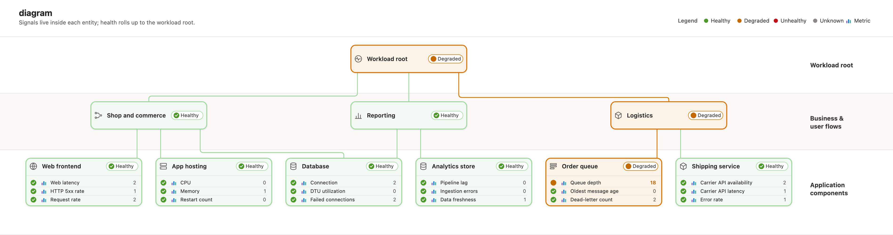
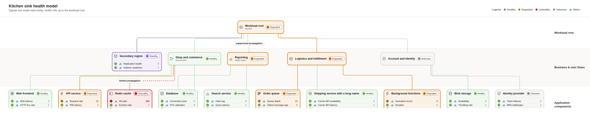
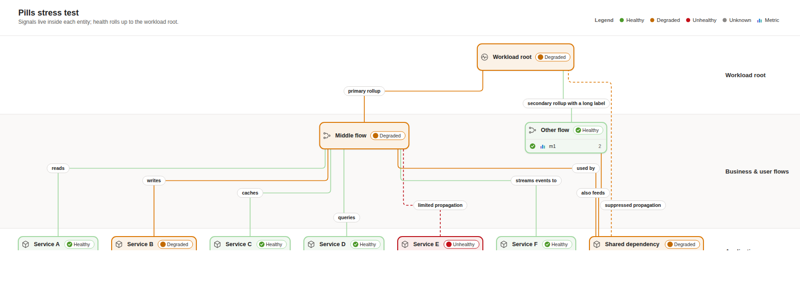
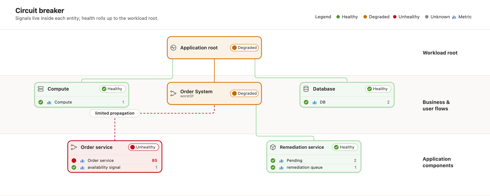
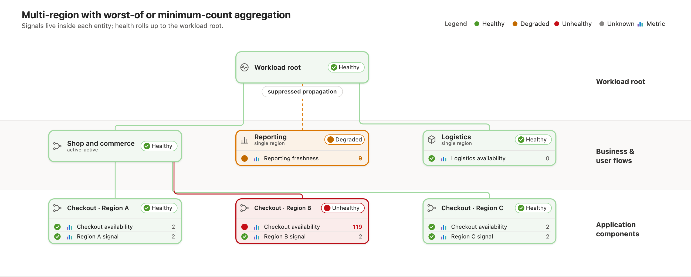
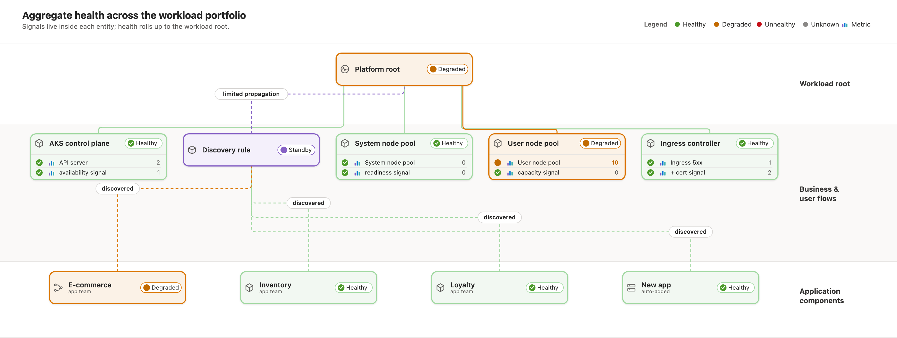
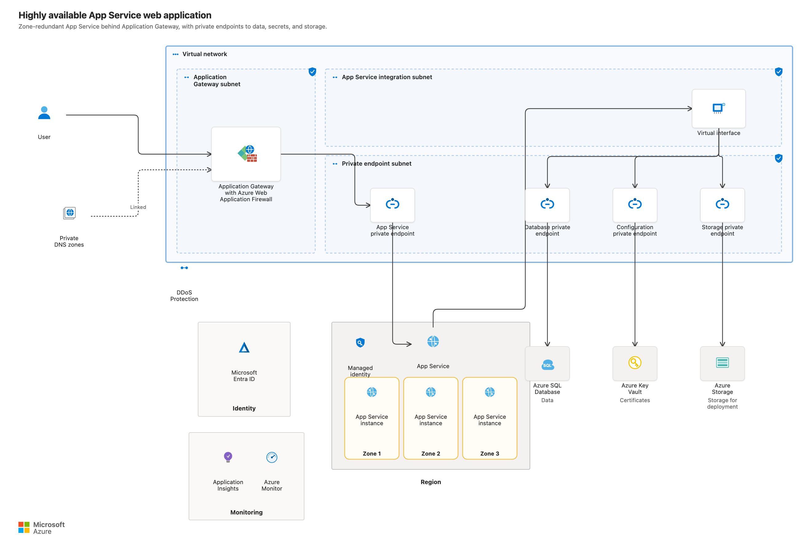
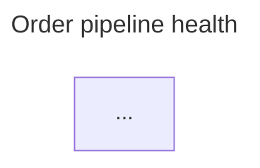

# ahm-diagrammo

Turn the mermaid blocks in a Markdown file into good-looking SVGs — with one command:

```bash
npx ahm-diagrammo your-doc.md
```

It grew out of replacing hand-drawn diagrams for **Azure Monitor health models** in the
Well-Architected Framework service guide, and that is still its specialty: Mermaid `flowchart BT`
health models become SVGs that look like the Azure portal health graph, render as `` on
Microsoft Learn (native `<text>`, no `foreignObject`), and scale without blurring. But every other
mermaid block in the file — sequence, state, ER, plain flowcharts — is rendered too, through
mermaid-cli with the same theme, so a whole document stays visually consistent.

## Examples

Signals live **inside** each entity as a status table (status dot, name, metric icon, result). Health
rolls up through business flows to the workload root. Relationship labels render as pills.



### Kitchen sink: one figure, every feature

Healthy, Degraded, Unhealthy, Unknown, and Standby states. Multi-row signal tables. Dashed propagation
edges. Qualifiers like worstOf and active-active. Long names, straight and elbow connectors.



### Pills stress test: labels that never collide

Many labeled edges converge on one parent, and one child feeds several parents. Each pill anchors on its
child's vertical drop, and the router levels edges by horizontal span. No pill overlaps another, no line
crosses another, and every pill belongs to one relationship.



### More examples

| | |
|---|---|
| Circuit breaker (limited propagation, unhealthy) | Multi-region (worst-of, tolerated failure) |
|  |  |
| Portfolio (nested models, discovered) | Architecture diagram (declarative) |
|  |  |

All 22 service-guide diagrams: [screenshots/gallery.png](screenshots/gallery.png).

## Usage

```bash
npx ahm-diagrammo doc.md                       # everything into ./diagrams + gallery.html
npx ahm-diagrammo doc.md -o out -t midnight    # pick an output dir and a default theme
npx ahm-diagrammo doc.md --list                # show what each block would render as
npx ahm-diagrammo doc.md --verbose             # log every parsed node/edge/fold decision
npx ahm-diagrammo doc.md --strict              # any warning fails the run (CI-friendly)
```

The command walks the file, and for each ` ```mermaid ` block:

- a **health model** (`flowchart BT` whose classes bind to `blue/green/amber/red/purple`) becomes a
  portal-style **swimlane** figure — pure code, no browser needed;
- **anything else** is rendered through mermaid-cli in the same theme (this path needs Chrome/Chromium;
  it finds one via `PUPPETEER_EXECUTABLE_PATH`, `CHROME_PATH`, or the usual install locations).

Each run writes the SVGs, a `manifest.json`, and a `gallery.html` you can open to browse everything at
once. Try the demo: `npx ahm-diagrammo examples/showcase.md -o out-showcase`.

## Tags & YAML: per-block options

Every block can override the CLI defaults, three ways — all invisible to GitHub's and VS Code's
mermaid preview:

**1. The fence line.** GitHub only reads the first word of the info string, so extra tokens are free:

````markdown

````

**2. `%%|` directive comments.** Mermaid treats `%%` lines as comments:

````markdown

````

**3. YAML frontmatter.** Mermaid understands the frontmatter block natively (`title:` even shows up
in previews); diagrammo reads the `diagrammo:` key:

````markdown

````

| Key | What it does |
|-----|--------------|
| `renderer` | `auto` (default), `swimlane`, or `mermaid` |
| `theme` | `portal` (default), `midnight`, `candy`, `slate` |
| `title` / `subtitle` | figure header text (title defaults to the nearest Markdown heading) |
| `lanes` | custom swimlane labels, top to bottom: `[Root, Flows, Services]` |
| `legend` | `false` hides the legend |
| `name` | output file name (defaults to a slug of the title/heading) |

Signal rows can carry a real measurement and their own state, straight in the mermaid label:

```text
apiSig["P95 latency = 230 ms (degraded)<br/>Error rate = 0.4%"] --> api[...]
```

Rows without a value get a plausible deterministic one, so drafts still look alive.

## Diagnostics: compiler-grade parse logging

Every line of every block is classified. Anything the parser can't place produces a warning with
the **absolute file line** and a hint; blocks that can't render at all fail with a reason:

```text
  FAIL doc.md:5  checkout-model: no nodes parsed — 3 unrecognized line(s), first at line 7
       warn  doc.md:7   unrecognized line: "this is not === valid mermaid at all"
             ↳ expected a node (id[Label]), an edge, class/classDef, or a comment
       warn  doc.md:9   unrecognized line: "---> dangling arrow"
             ↳ looks like an edge — supported forms: A --> B, A -->|label| B, A -- "label" --> B, ...
```

Warnings cover: unknown themes/renderers/option keys (each with the valid values), malformed
`%%|` directives, non-BT flowchart directions, unknown `class` names, ignored `subgraph`/`style`
statements, cycles and self-loops, same-lane or downward edges, orphan signal nodes, unclosed
fences, and any text that had to be clipped (which always keeps the full text as an SVG tooltip).
`--verbose` additionally logs every parsed edge, node, signal fold, and the graph summary.
`--strict` turns warnings into a failing exit code. Progress goes to stdout, diagnostics to stderr.

## Layout guarantees

The swimlane engine is a Sugiyama-style layered renderer with hard no-overlap rules, and each
rule is enforced by geometric tests, not by hope:

- **Everything is measured.** Text widths come from per-glyph advance tables, so cards, pills,
  lane gutters, and the legend size to their content. Long names wrap (cards grow to a cap)
  before anything is ever ellipsized; the rare clip keeps a tooltip and warns.
- **Cards can't overlap.** Per-lane coordinates come from constrained 1-D projection
  (cluster-merge): nodes sit at the mean of their neighbors subject to minimum separations.
- **Connectors can't cross cards.** Lane-skipping edges ride corridors — the verified gaps
  between cards of the lanes they pass through.
- **Horizontal runs can't collide.** Each channel between lanes reserves interval-colored
  tracks for labeled/dashed/skipping edges and for the per-parent buses; the channel grows to
  fit its rows, so density costs height, never legibility.
- **Pills stay readable.** Label pills wrap to two lines when long, sit on rows nearest their
  child (where crossing connectors are sparse), get repaired onto a different row when the
  assignment pins them under a connector, and finally slide along their own line to a
  verified-clear spot.

`npm test` runs the suite: unit tests for the layout algorithms, parse-diagnostic tests, CLI
end-to-end tests (real process spawns, exit codes, log format), a mermaid-cli smoke test (skipped
without Chrome), and — the heart of it — a geometric verifier that renders torture fixtures
(lane-skipping meshes, a 16-pill flood, 14-row tables, unicode extremes, cycles) and asserts that
no card, pill, connector, or text box overlaps, escapes its container, or leaves the canvas.

## What's inside

| Tool | What it does |
|------|--------------|
| `bin/diagrammo.mjs` | The `npx ahm-diagrammo` CLI: extracts blocks, picks a renderer per block, applies themes and per-block options, writes SVGs + manifest + gallery. |
| `src/swimlane.mjs` | The swimlane engine. Parses `flowchart BT` into a graph, folds signals into their entity as a status table, layers the graph into swimlanes, and renders portal-styled SVG with roll-up connectors and pill labels. |
| `src/mermaid.mjs` | Themed Mermaid via mermaid-cli for everything else. Keeps the original node shapes, applies the theme palette, polishes corners and shadows. |
| `src/themes.mjs` | The four themes, shared by both renderers. |
| `src/layout.mjs` | The pure layout algorithms: constrained 1-D projection, interval-colored track assignment, corridor picking. |
| `src/text.mjs` | Browser-free text measurement (per-glyph advance widths) and wrapping. |
| `src/diag.mjs` | Structured diagnostics with file:line attribution. |
| `src/extract.mjs` | Markdown fence extraction plus the three option channels (fence info, `%%\|` directives, frontmatter), with option validation. |
| `test/` | The suite: layout unit tests, parse-diagnostic tests, CLI e2e tests, and the geometric overlap verifier run against the torture fixtures in `test/fixtures/`. |
| `swimlane-auto.mjs`, `convert.mjs` | Legacy entry points (`node swimlane-auto.mjs <md> <outDir>`), kept for existing workflows; both delegate to `src/`. |
| `arch/` | Declarative Azure architecture-diagram engine: containers, orthogonal routing, pluggable icons. |
| `ingest-demo/` | An `az monitor health-models` deploy plus `ingest-health-report` recipe. Force live states, then screenshot the real portal. |
| `examples/showcase.md` | One file exercising every feature — render it and open the gallery. |
| `EVALUATION.md` | The options analysis: Mermaid theme, draw.io, portal CSS, screenshots, layered. |

The reference set of generated SVGs lives under [`svg/`](svg/).

## Design notes

- **Learn-safe SVG.** Set `htmlLabels:false` everywhere, so labels become native `<text>`/`<tspan>` and
  render inside ``. Never `<foreignObject>`.
- **Portal palette** from the health-models portal source: Healthy `#a0d8a0`, Degraded `#db7500`,
  Unhealthy `#ba0d16`, Unknown `#c8c6c4`, signal and azure `#0078d4`.
- **Signals sit in the entity**, not beside it. The generator folds each signal into an attached
  4-column table.
- **Roll-up connectors take the child's state color.** A tolerated failure (active-active, worst-of)
  keeps the parent green while the failing child's own line stays red.
- **Pills anchor at the child's vertical drop** and level by horizontal span, so they never overlap and
  always sit on one line.
- **Zero install weight for the common path.** The package has no runtime dependencies; the swimlane
  renderer is pure Node. Only non-health blocks need mermaid-cli, which is resolved from your project,
  your PATH, or fetched once via npx.
- Render preview PNGs with headless Chrome, not librsvg. librsvg drops leading `<tspan>` spaces.

## Icons and licensing

The health-model generators draw only original, in-code glyphs. No external icon assets.

The architecture engine (`arch/`) takes pluggable icons and can use the official Microsoft Azure
architecture icons once you drop them into `arch/icons/`. This repo does not carry those icons; the
checked-in architecture SVG uses the original fallback glyphs instead. See `arch/icons/README.md`.

## License

MIT (see `LICENSE`). Diagrams generated by these tools carry no third-party icon assets.
