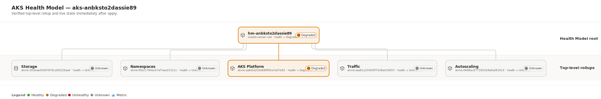
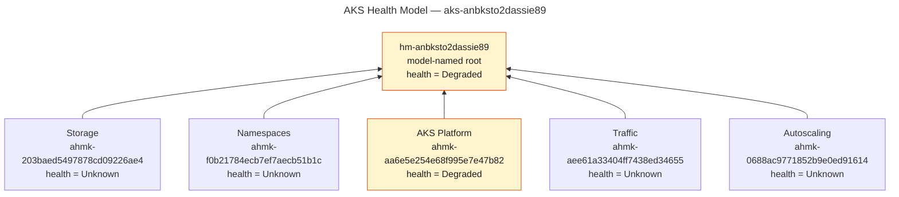

# AKS health model for `aks-anbksto2dassie89`

This page records the Health Model created from the live AKS cluster by
`ahm-for-k8s`, the exact Azure prerequisites and commands used, and the topology
verified after deployment. The model was created only by
`python3 -m ahm_k8s plan` followed by `python3 -m ahm_k8s apply`; Azure CLI was
used only for the required identity, its scoped role assignments, and exact
target reads.

## Result

| Item | Observed value |
|---|---|
| AKS resource | `/subscriptions/b2af20ad-98fa-4aa7-94c3-059663641d9f/resourceGroups/rg-anbksto2dassie89/providers/Microsoft.ContainerService/managedClusters/aks-anbksto2dassie89` |
| AKS location and state | `eastus2`; `Succeeded`; `Running` |
| Health Model resource | `/subscriptions/b2af20ad-98fa-4aa7-94c3-059663641d9f/resourceGroups/rg-anbksto2dassie89/providers/Microsoft.CloudHealth/healthmodels/hm-anbksto2dassie89` |
| Health Model location | `centralus`, selected from the current `Microsoft.CloudHealth/healthmodels` provider location list |
| User-assigned identity | `/subscriptions/b2af20ad-98fa-4aa7-94c3-059663641d9f/resourceGroups/rg-anbksto2dassie89/providers/Microsoft.ManagedIdentity/userAssignedIdentities/id-hm-anbksto2dassie89` |
| Identity principal | `3d7dbdda-c1f9-4691-8d1c-5937257d27e9` |
| Azure Monitor workspace | `/subscriptions/b2af20ad-98fa-4aa7-94c3-059663641d9f/resourceGroups/rg-anbksto2dassie89/providers/Microsoft.Monitor/accounts/metrics-anbksto2dassie89` |
| Prometheus endpoint | `https://metrics-anbksto2dassie89-erhkgge8heg0c9fy.eastus2.prometheus.monitor.azure.com` |
| PromQL choice | Enabled with the linked Azure Monitor workspace; `--no-promql` was not used |
| Deployment stack | `ahm-k8s-hm-anbksto2dassie89-4e6a01e9` |
| Tool owner ID | `ahm-k8s-6acd566415adc6e44e6a01e9` |
| Apply result | Exit `0`; no failed resources; model provisioning state `Succeeded` |
| Live topology parity | `79` entities and `95` relationships, equal to `desired-state.json` |

## Verified topology

The model-named entity is the only parentless entity. Its five direct children
are the complete top-level rollup from the generated and live topology. Arrows
in the figure point from child to parent because health rolls up bottom-to-top;
the table below preserves the Azure relationship's explicit parent and child
fields.



<details>
<summary>Editable Mermaid source</summary>



</details>

Regenerate the committed SVG from this Markdown file using the commands in
[Render and verify the documentation](#8-render-and-verify-the-documentation).

### Top-level entities

| Entity name | Display name | Live health state |
|---|---|---|
| `hm-anbksto2dassie89` | `hm-anbksto2dassie89` | `Degraded` |
| `ahmk-203baed5497878cd09226ae4` | `Storage` | `Unknown` |
| `ahmk-f0b21784ecb7ef7aecb51b1c` | `Namespaces` | `Unknown` |
| `ahmk-aa6e5e254e68f995e7e47b82` | `AKS Platform` | `Degraded` |
| `ahmk-aee61a33404ff7438ed34655` | `Traffic` | `Unknown` |
| `ahmk-0688ac9771852b9e0ed91614` | `Autoscaling` | `Unknown` |

### Top-level relationships

| Relationship name | Parent entity | Child entity | Display name |
|---|---|---|---|
| `ahmk-2010c4547b90edd056a3cbd0` | `hm-anbksto2dassie89` | `ahmk-203baed5497878cd09226ae4` | `hm-anbksto2dassie89 → Storage` |
| `ahmk-52f6035c38e1cd32c73d1076` | `hm-anbksto2dassie89` | `ahmk-f0b21784ecb7ef7aecb51b1c` | `hm-anbksto2dassie89 → Namespaces` |
| `ahmk-7557a1ace31b9a3ddea291db` | `hm-anbksto2dassie89` | `ahmk-aa6e5e254e68f995e7e47b82` | `hm-anbksto2dassie89 → AKS Platform` |
| `ahmk-c75c2ea72172192ccbe47fc0` | `hm-anbksto2dassie89` | `ahmk-aee61a33404ff7438ed34655` | `hm-anbksto2dassie89 → Traffic` |
| `ahmk-f487a1a503821550c252ec45` | `hm-anbksto2dassie89` | `ahmk-0688ac9771852b9e0ed91614` | `hm-anbksto2dassie89 → Autoscaling` |

The complete live tree continues below these rollups. For example, `Namespaces`
contains the discovered namespace entities, `AKS Platform` contains the AKS,
node-health, and ACNS/Cilium/Hubble entities, `Traffic` contains discovered
Services, and `Autoscaling` contains discovered HPA and node
auto-provisioning entities. The generated `desired-state.json` is the canonical
complete topology.

## Live state and warnings

Immediately after apply, all `79` entities had provisioning state `Succeeded`.
The point-in-time health distribution was `3` `Degraded` and `76` `Unknown`:

- `hm-anbksto2dassie89`, `AKS Platform`, and
  `AKS aks-anbksto2dassie89` were `Degraded`.
- All other entities were `Unknown`.

Provisioning success means Azure accepted the model; it does not mean every
signal has already produced a healthy value. The plan emitted `65` warnings
from the live discovery:

| Warning category | Count | Meaning |
|---|---:|---|
| Container CPU or memory request omitted | 48 | The discovered workload cannot be scored for that request dimension. |
| Optional Kubernetes API absent or empty | 6 | KEDA, VPA, Gateway API, and Istio topology was not available or populated. |
| Prometheus metric unavailable | 5 | Istio, Karpenter, and StatefulSet metric names were not present. |
| ACNS limitation | 2 | Flow volume was observed but conservative HTTP/lost-event health scoring was not available. |
| Optional Prometheus series empty | 2 | `hubble_dns_responses_total` and `karpenter_pods_state` had no selected-cluster series. |
| Optional AMA configuration unavailable | 1 | The optional AMA ConfigMap could not be read. |
| NAP/Karpenter topology without evidenced health metrics | 1 | Topology was modeled, but no matching health metric was proven. |

PromQL remained enabled because the exact AKS monitoring association resolved
through `dcr-aks-anbksto2dassie89` and
`MSProm-eastus2-aks-anbksto2dassie89` to the existing workspace. Discovery
observed `15` Prometheus metric names for cluster label
`aks-anbksto2dassie89`.

## Execution record

All Python commands in steps 1–7 ran from:

```bash
cd /Users/abossard/Desktop/projects/ahm-for-k8s
```

The exact values used throughout were:

```bash
SUBSCRIPTION_ID="b2af20ad-98fa-4aa7-94c3-059663641d9f"
RESOURCE_GROUP="rg-anbksto2dassie89"
AKS_NAME="aks-anbksto2dassie89"
AKS_ID="/subscriptions/b2af20ad-98fa-4aa7-94c3-059663641d9f/resourceGroups/rg-anbksto2dassie89/providers/Microsoft.ContainerService/managedClusters/aks-anbksto2dassie89"
MODEL_ID="/subscriptions/b2af20ad-98fa-4aa7-94c3-059663641d9f/resourceGroups/rg-anbksto2dassie89/providers/Microsoft.CloudHealth/healthmodels/hm-anbksto2dassie89"
IDENTITY_ID="/subscriptions/b2af20ad-98fa-4aa7-94c3-059663641d9f/resourceGroups/rg-anbksto2dassie89/providers/Microsoft.ManagedIdentity/userAssignedIdentities/id-hm-anbksto2dassie89"
AMW_ID="/subscriptions/b2af20ad-98fa-4aa7-94c3-059663641d9f/resourceGroups/rg-anbksto2dassie89/providers/Microsoft.Monitor/accounts/metrics-anbksto2dassie89"
DCR_ID="/subscriptions/b2af20ad-98fa-4aa7-94c3-059663641d9f/resourceGroups/rg-anbksto2dassie89/providers/Microsoft.Insights/dataCollectionRules/MSProm-eastus2-aks-anbksto2dassie89"
DCRA_ID="$AKS_ID/providers/Microsoft.Insights/dataCollectionRuleAssociations/dcr-aks-anbksto2dassie89"
PRINCIPAL_ID="3d7dbdda-c1f9-4691-8d1c-5937257d27e9"
```

### 1. Verify the exact target and telemetry chain

```bash
az account show --output json
az group show \
  --subscription "$SUBSCRIPTION_ID" \
  --name "$RESOURCE_GROUP" \
  --output json
az aks show \
  --subscription "$SUBSCRIPTION_ID" \
  --resource-group "$RESOURCE_GROUP" \
  --name "$AKS_NAME" \
  --output json
az provider show \
  --subscription "$SUBSCRIPTION_ID" \
  --namespace Microsoft.CloudHealth \
  --output json
kubectl --context aks-anbksto2dassie89 get --raw=/readyz

az rest \
  --method get \
  --url "https://management.azure.com${DCRA_ID}?api-version=2023-03-11" \
  --output json
az resource show \
  --ids "$DCR_ID" \
  --api-version 2023-03-11 \
  --output json
az resource show \
  --ids "$AMW_ID" \
  --api-version 2023-04-03 \
  --output json

az identity show \
  --subscription "$SUBSCRIPTION_ID" \
  --resource-group "$RESOURCE_GROUP" \
  --name id-hm-anbksto2dassie89 \
  --output json
az resource show \
  --ids "$MODEL_ID" \
  --api-version 2026-05-01-preview \
  --output json
```

The group and AKS were ready, `Central US` appeared in the provider's
`healthmodels` locations, `/readyz` returned `ok`, and the DCRA → DCR → AMW
chain matched the IDs above. The exact identity and model reads returned not
found before prerequisite creation and planning.

### 2. Create only the required identity and RBAC

```bash
az identity create \
  --subscription "$SUBSCRIPTION_ID" \
  --resource-group "$RESOURCE_GROUP" \
  --name id-hm-anbksto2dassie89 \
  --location eastus2 \
  --output json

az role assignment create \
  --subscription "$SUBSCRIPTION_ID" \
  --assignee-object-id "$PRINCIPAL_ID" \
  --assignee-principal-type ServicePrincipal \
  --role Reader \
  --scope "$AKS_ID" \
  --output json

az role assignment create \
  --subscription "$SUBSCRIPTION_ID" \
  --assignee-object-id "$PRINCIPAL_ID" \
  --assignee-principal-type ServicePrincipal \
  --role "Monitoring Data Reader" \
  --scope "$AMW_ID" \
  --output json
```

`Reader` lets the model identity observe the exact AKS resource. `Monitoring
Data Reader` lets it query the linked Azure Monitor workspace. Each assignment
was then read back for the exact principal and scope:

```bash
az role assignment list \
  --subscription "$SUBSCRIPTION_ID" \
  --assignee-object-id "$PRINCIPAL_ID" \
  --scope "$AKS_ID" \
  --output json
az role assignment list \
  --subscription "$SUBSCRIPTION_ID" \
  --assignee-object-id "$PRINCIPAL_ID" \
  --scope "$AMW_ID" \
  --output json
```

### 3. Validate the preserved Azure response compatibility

The narrow compatibility change accepts both nested and flattened Azure
deployment-stack responses at the shared plan/apply call sites.

```bash
python3 -m unittest tests.test_azure -v
python3 -m unittest tests.test_docs -v
```

The first command ran the parameterized supported/malformed response cases;
both commands exited `0` (`1` compatibility test and `5` CLI documentation
contract tests).

### 4. Build the sealed plan

```bash
python3 -m ahm_k8s plan \
  --aks-resource-id "$AKS_ID" \
  --target-resource-group rg-anbksto2dassie89 \
  --model-name hm-anbksto2dassie89 \
  --health-model-location centralus \
  --identity-resource-id "$IDENTITY_ID" \
  --azure-monitor-workspace-resource-id "$AMW_ID" \
  --context aks-anbksto2dassie89 \
  --output-dir generated/aks-anbksto2dassie89
```

The successful run exited `0` and planned `176` additions, no updates, no
removals, and no unmanaged resources. A local kubelogin/Azure CLI runtime
problem interrupted earlier discovery attempts; after the exact readiness
retry and credential refresh still reproduced it, the missing `rpds` runtime
module was repaired. The plan command itself was not bypassed or replaced.

The six non-empty generated artifacts were:

| Artifact | Bytes |
|---|---:|
| `cluster.snapshot.json` | 109310 |
| `desired-state.json` | 767520 |
| `health-model.bicep` | 6724 |
| `health-model.bicepparam` | 345808 |
| `health-model.parameters.json` | 384968 |
| `reconcile.plan.json` | 156966 |

The JSON artifacts and both Bicep forms were checked directly:

```bash
jq -e . generated/aks-anbksto2dassie89/cluster.snapshot.json >/dev/null
jq -e . generated/aks-anbksto2dassie89/desired-state.json >/dev/null
jq -e . generated/aks-anbksto2dassie89/health-model.parameters.json >/dev/null
jq -e . generated/aks-anbksto2dassie89/reconcile.plan.json >/dev/null
az bicep build \
  --file generated/aks-anbksto2dassie89/health-model.bicep \
  --stdout >/dev/null
az bicep build-params \
  --file generated/aks-anbksto2dassie89/health-model.bicepparam \
  --stdout >/dev/null
```

### 5. Recheck ownership immediately before apply

The plan-derived stack name and exact model were both absent before apply:

```bash
az resource show \
  --ids "$MODEL_ID" \
  --api-version 2026-05-01-preview \
  --output json
az stack group show \
  --subscription "$SUBSCRIPTION_ID" \
  --resource-group "$RESOURCE_GROUP" \
  --name ahm-k8s-hm-anbksto2dassie89-4e6a01e9 \
  --output json
```

Both exact reads returned not found. The AKS, DCRA, DCR, workspace, identity,
and two scoped assignments were also re-read successfully. No other Health
Model was listed or inspected.

### 6. Apply through the Python CLI

```bash
python3 -m ahm_k8s apply \
  --plan generated/aks-anbksto2dassie89/reconcile.plan.json
```

No `--print-command` and no `--prune` were used. The Python process exited `0`,
reported no failed or deleted resources, and performed the creation through
the sealed deployment stack.

### 7. Verify the exact live model and complete topology

```bash
az resource show \
  --ids "$MODEL_ID" \
  --api-version 2026-05-01-preview \
  --output json
```

That exact read returned model `hm-anbksto2dassie89`, location `centralus`,
owner `ahm-k8s-6acd566415adc6e44e6a01e9`, and provisioning state `Succeeded`.

The entity and relationship collection reads followed every `nextLink`:

```bash
VERIFY_DIR="generated/aks-anbksto2dassie89/.verify"
mkdir -p "$VERIFY_DIR"

for COLLECTION in entities relationships; do
  URL="https://management.azure.com${MODEL_ID}/${COLLECTION}?api-version=2026-05-01-preview"
  PAGE=1
  while [ -n "$URL" ]; do
    az rest \
      --method get \
      --url "$URL" \
      --output json >"$VERIFY_DIR/${COLLECTION}.page${PAGE}.json"
    URL="$(jq -r '.nextLink // empty' "$VERIFY_DIR/${COLLECTION}.page${PAGE}.json")"
    PAGE=$((PAGE + 1))
  done
  jq -s '[.[].value[]]' \
    "$VERIFY_DIR/${COLLECTION}".page*.json \
    >"$VERIFY_DIR/${COLLECTION}.json"
done
```

Both collections used two pages. Canonical entity names and relationship
name/parent/child triples were compared to `desired-state.json` with `jq`:

```bash
jq -e \
  --slurpfile live "$VERIFY_DIR/entities.json" \
  '([.clusterModel.entities[].name] | sort) as $desired
   | ($live[0] | map(.name) | sort) as $actual
   | select($desired == $actual
       and ($actual | unique | length) == ($actual | length))' \
  generated/aks-anbksto2dassie89/desired-state.json >/dev/null

jq -e \
  --slurpfile live "$VERIFY_DIR/relationships.json" \
  '([.resources[]
      | select((.resourceType | ascii_downcase)
          == "microsoft.cloudhealth/healthmodels/relationships")
      | {
          name: (.azureResourceId | split("/") | last),
          parent: .content.properties.parentEntityName,
          child: .content.properties.childEntityName
        }] | sort_by(.name, .parent, .child)) as $desired
   | ($live[0]
      | map({
          name,
          parent: .properties.parentEntityName,
          child: .properties.childEntityName
        })
      | sort_by(.name, .parent, .child)) as $actual
   | select($desired == $actual
       and ($actual | unique_by(.name) | length) == ($actual | length)
       and ($actual | unique_by([.parent, .child]) | length)
          == ($actual | length))' \
  generated/aks-anbksto2dassie89/desired-state.json >/dev/null
```

The assertions passed for `79` entities and `95` relationships. The set of
entities never used as a relationship child was exactly
`["hm-anbksto2dassie89"]`; the root had no parent and its five live children
equaled the desired top-level set.

### 8. Render and verify the documentation

These commands run from the `ahm-diagrammo` checkout:

```bash
cd /Users/abossard/Desktop/projects/ahm-diagrammo

node bin/diagrammo.mjs \
  docs/aks-anbksto2dassie89-health-model.md \
  --list

node bin/diagrammo.mjs \
  docs/aks-anbksto2dassie89-health-model.md \
  --out out-aks-anbksto2dassie89 \
  --strict

jq -e \
  'length == 1
   and .[0].slug == "aks-anbksto2dassie89-health-model"
   and .[0].svg == "aks-anbksto2dassie89-health-model.svg"
   and .[0].renderer == "swimlane"' \
  out-aks-anbksto2dassie89/manifest.json >/dev/null
test -s out-aks-anbksto2dassie89/aks-anbksto2dassie89-health-model.svg
rg -q '<text' out-aks-anbksto2dassie89/aks-anbksto2dassie89-health-model.svg
if rg -q '<foreignObject' \
  out-aks-anbksto2dassie89/aks-anbksto2dassie89-health-model.svg; then
  exit 1
fi

cp \
  out-aks-anbksto2dassie89/aks-anbksto2dassie89-health-model.svg \
  docs/assets/aks-anbksto2dassie89-health-model.svg
rm -r out-aks-anbksto2dassie89
```

The strict render and manifest checks ensure this Markdown has one Mermaid
block, the output is a non-empty swimlane SVG, labels use native SVG `<text>`,
and no `foreignObject` is present.

## Safe regeneration

Always run a fresh `plan` before a later `apply`; the plan seals the observed
stack and resource state. Review all planned actions. This initial run had no
removals, and this procedure never used `--prune`.
