# Feature gallery (source of truth)

This page is the source for its own images.

Regenerate both rendering sets from these Mermaid blocks:

```bash
npx ahm-diagrammo docs/feature-gallery.md -o docs/assets/feature-gallery/ahm --no-gallery
npx ahm-diagrammo docs/feature-gallery.md -o docs/assets/feature-gallery/vanilla -r mermaid --no-gallery
```

For each feature: Mermaid source first, then `vanilla` (`-r mermaid`) and `ahm-diagrammo` (`auto`) output.

## 1. Auto health-model detection (`flowchart BT` + health classes)

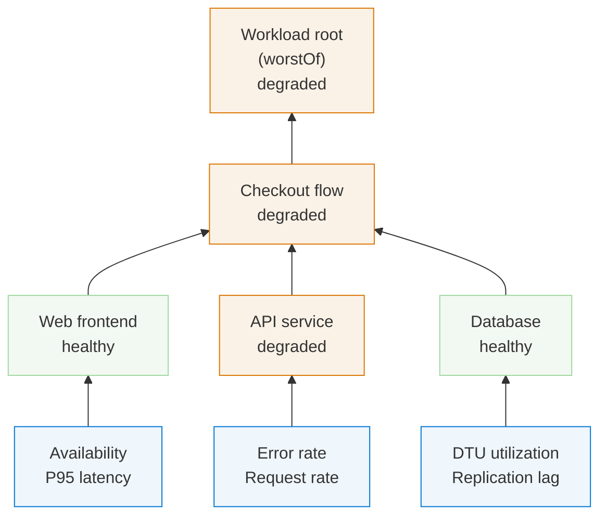

| Vanilla Mermaid | ahm-diagrammo |
|---|---|
|  | 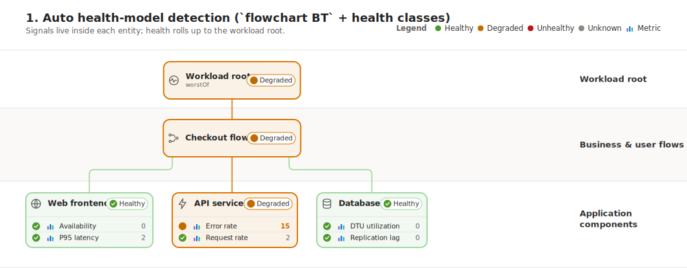 |

## 2. Fence-info options (`mermaid midnight`)

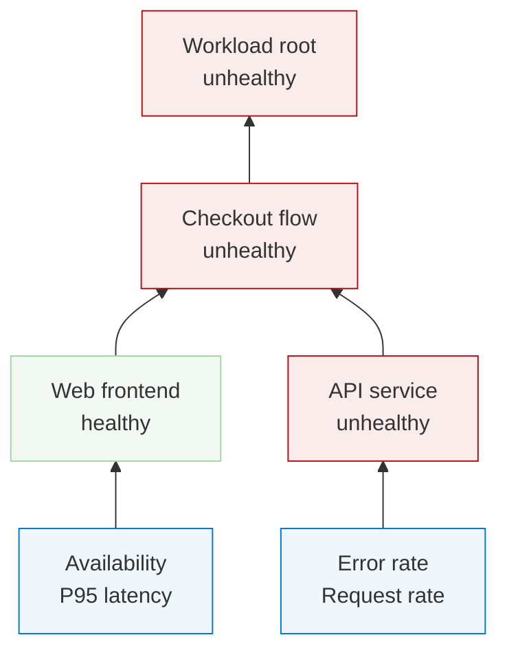

| Vanilla Mermaid | ahm-diagrammo |
|---|---|
|  | 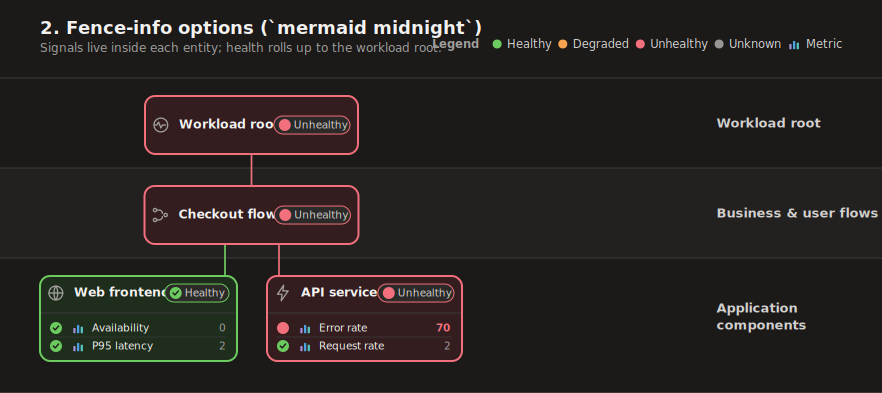 |

## 3. YAML frontmatter (`title`, `theme`, `subtitle`, `lanes`)

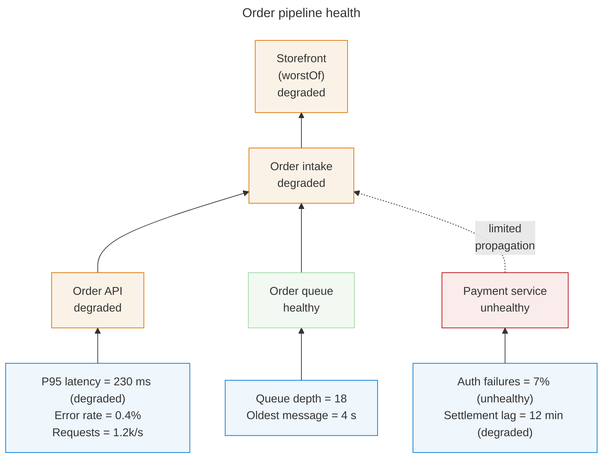

| Vanilla Mermaid | ahm-diagrammo |
|---|---|
|  | 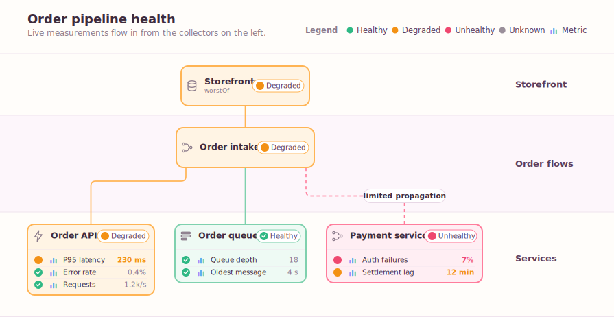 |

## 4. Directive comments (`%%|`) and `legend: false`

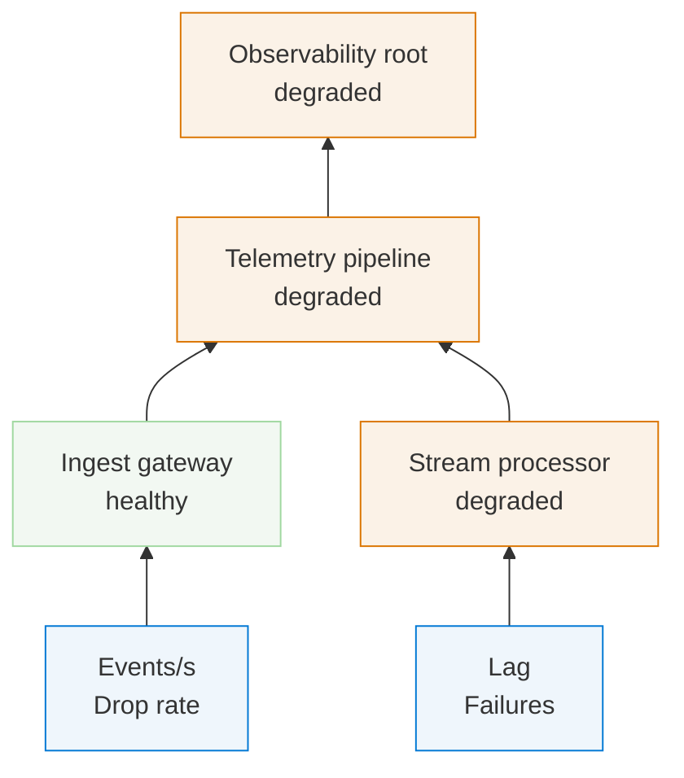

| Vanilla Mermaid | ahm-diagrammo |
|---|---|
|  | 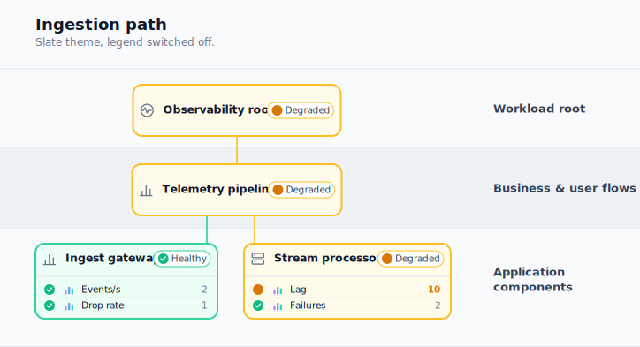 |

## 5. Signal-row values and row states

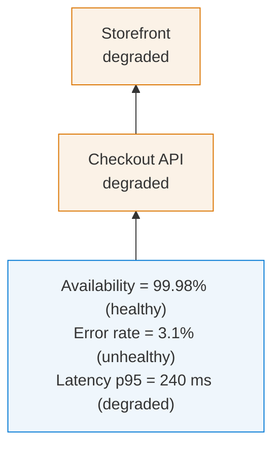

| Vanilla Mermaid | ahm-diagrammo |
|---|---|
|  | 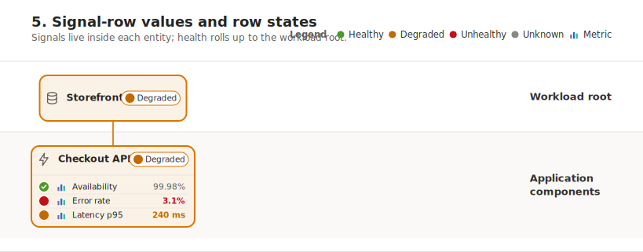 |

## 6. Dashed propagation edges and relationship pills

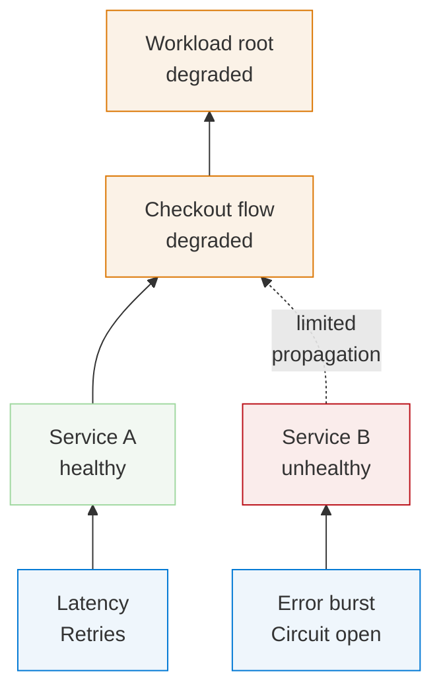

| Vanilla Mermaid | ahm-diagrammo |
|---|---|
|  | 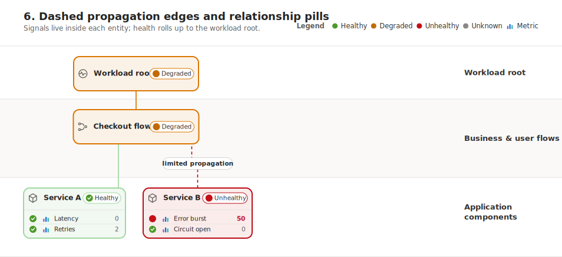 |

## 7. Non-health Mermaid blocks (sequence)

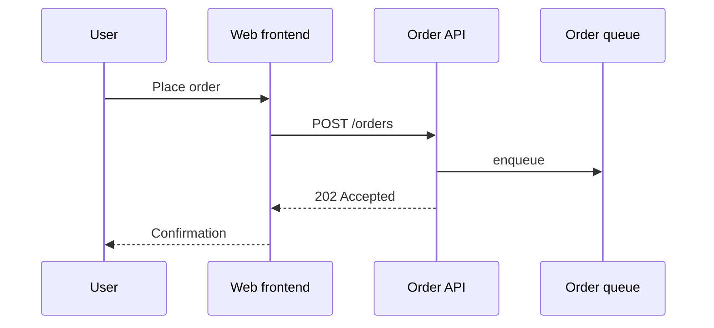

| Vanilla Mermaid | ahm-diagrammo |
|---|---|
|  | 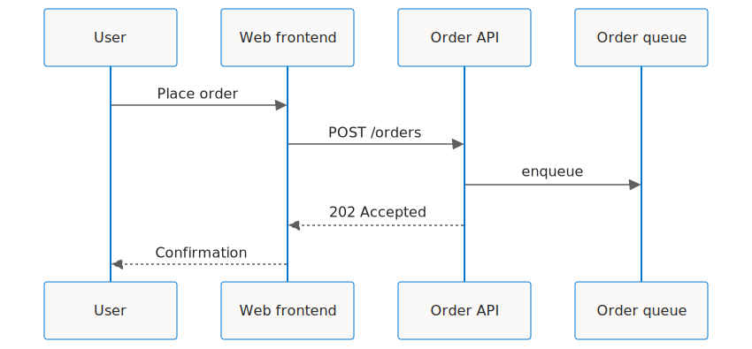 |

## 8. Forcing a renderer (`renderer: mermaid` on a health model)

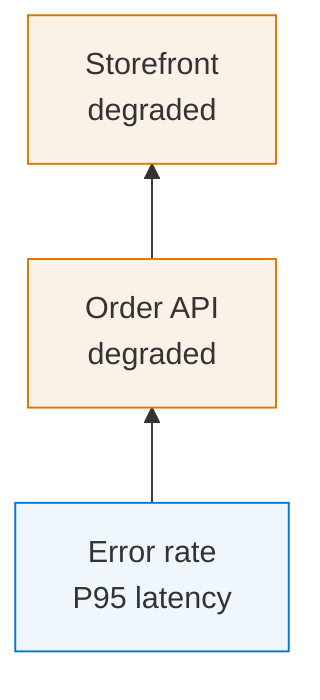

| Vanilla Mermaid | ahm-diagrammo |
|---|---|
|  |  |

## 9. `name` and `background` options on plain Mermaid

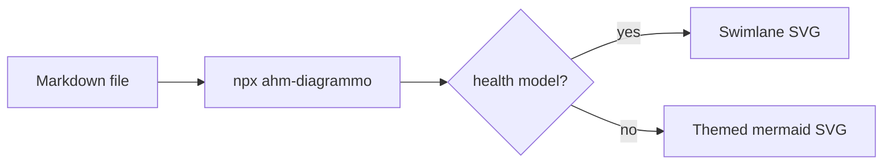

| Vanilla Mermaid | ahm-diagrammo |
|---|---|
|  |  |

## 10. Theme override on plain flowchart

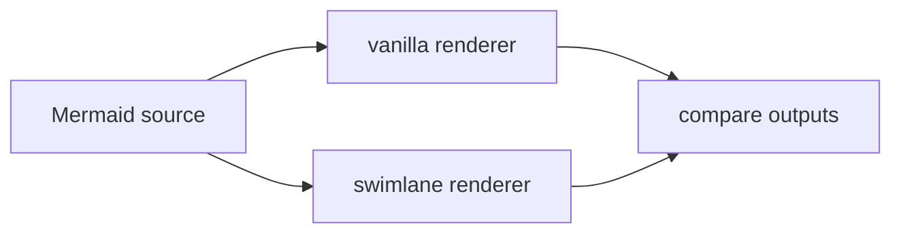

| Vanilla Mermaid | ahm-diagrammo |
|---|---|
|  |  |
