<!-- Generated by `npm run gallery` from source.md. Edit source.md, not this file. -->

# Gallery: every feature, both looks

Every example on this page is an ordinary ` ```mermaid ` block from [source.md](source.md). Each
health model is rendered twice: with the **swimlane** renderer (the default) and with the **Pele**
renderer (`-r pele` or `renderer: pele`). Diagrams that are not health models have a single look,
rendered by Pele in the block's theme. Expand **Source** under any example to copy it.

To change the gallery, edit [source.md](source.md) and run `npm run gallery`. This page and the
SVGs in [svg/](svg/) are generated; `npm run gallery:check` fails when they are out of date.

- [Health models](#health-models): zero config, entity states, signal rows, relationships,
  qualifiers, deep models, labeled relationships, long text
- [Themes](#themes): portal, midnight, candy, slate
- [Options](#options): title and subtitle, lane names, legend, lane labels, plain Mermaid look
- [Other Mermaid diagrams](#other-mermaid-diagrams): flowchart, sequence, state, ER, pie
- [Pele library options](#pele-library-options): direction, table headers, colors, font size,
  nested models

## Health models

A health model is a `flowchart BT` (or `graph BT`) whose nodes use the health classes. Children
point at their parents (`child --> parent`), so health rolls up toward the root at the top.

### Health model, zero config

Nothing to configure: the classes alone mark this block as a health model. The `classDef` lines
are optional; they only color GitHub's and VS Code's Mermaid preview.

**Swimlane look (default)**

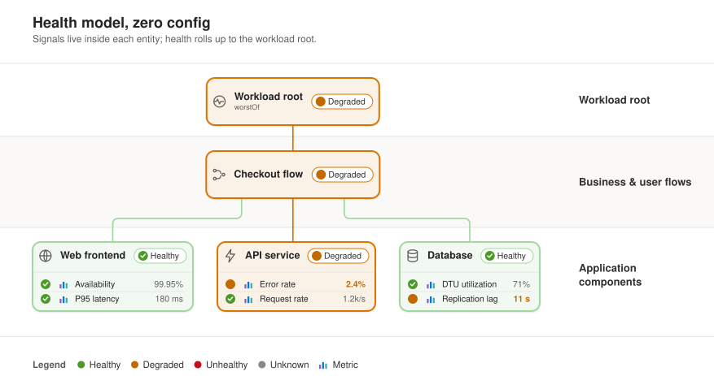

**Pele look (`-r pele`)**

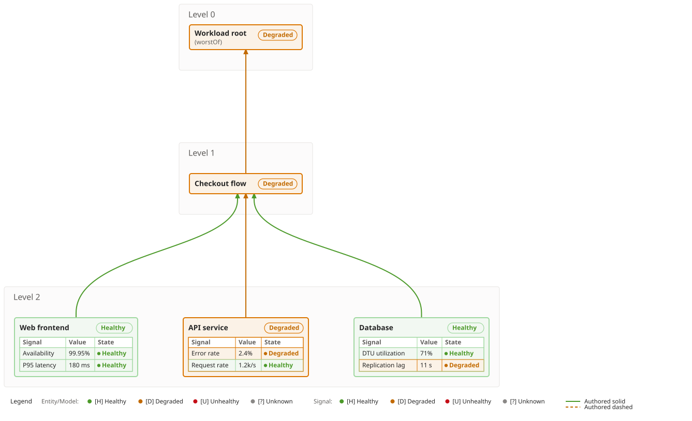

<details><summary>Source</summary>

````markdown
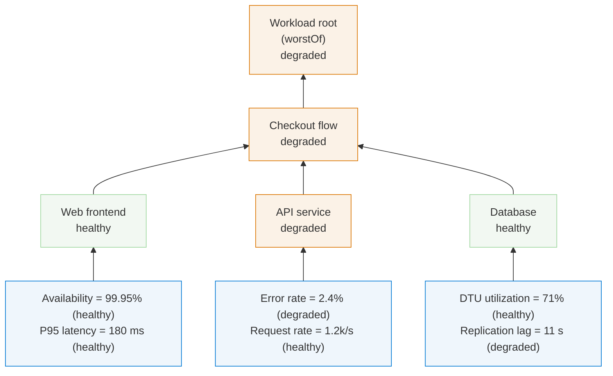
```mermaid
flowchart BT
    webSig["Availability = 99.95% (healthy)<br/>P95 latency = 180 ms (healthy)"] --> web["Web frontend<br/>healthy"]
    apiSig["Error rate = 2.4% (degraded)<br/>Request rate = 1.2k/s (healthy)"] --> api["API service<br/>degraded"]
    dbSig["DTU utilization = 71% (healthy)<br/>Replication lag = 11 s (degraded)"] --> db["Database<br/>healthy"]

    web --> checkout["Checkout flow<br/>degraded"]
    api --> checkout
    db --> checkout
    checkout --> root["Workload root<br/>(worstOf)<br/>degraded"]

    classDef blue fill:#eff6fc,stroke:#0078D4;
    classDef green fill:#f2f8f2,stroke:#a0d8a0;
    classDef amber fill:#fbf2e7,stroke:#db7500;
    class webSig,apiSig,dbSig blue;
    class web,db green;
    class api,checkout,root amber;
```
````

</details>

### Entity states

`green` is healthy, `amber` degraded, `red` unhealthy and `purple` standby. A node without a
health class is unknown. A state word on its own label line (`Order API<br/>degraded`) is hidden
from the card; Pele also accepts it as the state when the node has no class, and both must agree.

**Swimlane look (default)**

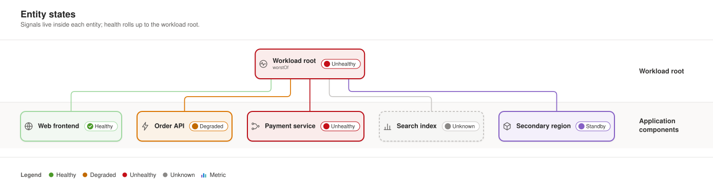

**Pele look (`-r pele`)**

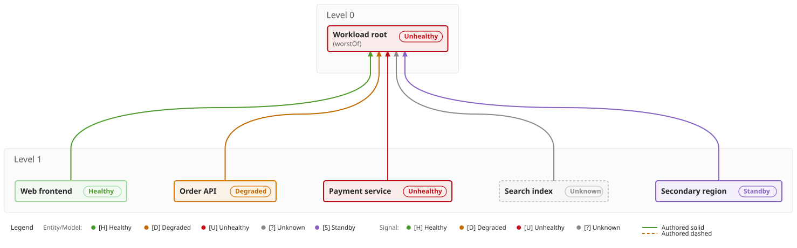

<details><summary>Source</summary>

````markdown
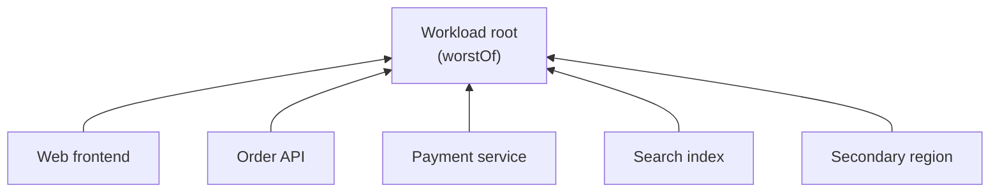
```mermaid
flowchart BT
    ok["Web frontend"] --> root["Workload root<br/>(worstOf)"]
    slow["Order API"] --> root
    down["Payment service"] --> root
    dark["Search index"] --> root
    spare["Secondary region"] --> root
    class ok green;
    class slow amber;
    class down red;
    class spare purple;
    class root red;
```
````

</details>

### Signal rows

A `blue` node is a signal: each label line becomes one row in its entity's table. Write
`name`, `name = value` or `name = value (state)`. Row states are independent of the entity's
state. Where a row leaves something out, the looks differ: a missing value is a placeholder number
in the swimlane look and `∅` in the Pele look, and a missing state is healthy in the swimlane look
and unknown in the Pele look.

**Swimlane look (default)**

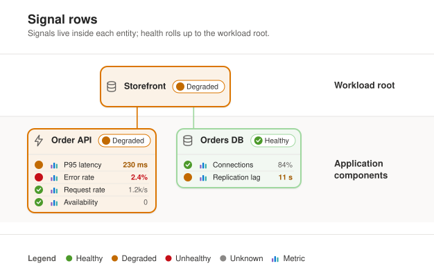

**Pele look (`-r pele`)**

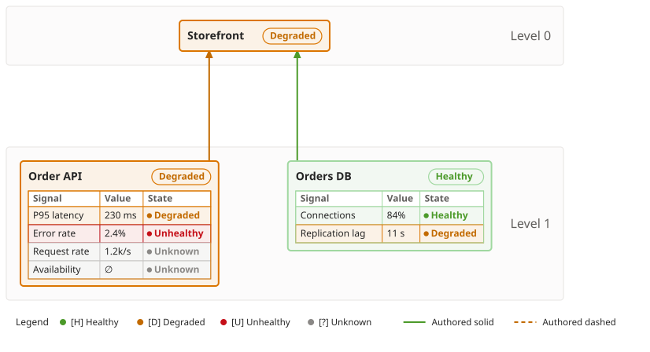

<details><summary>Source</summary>

````markdown
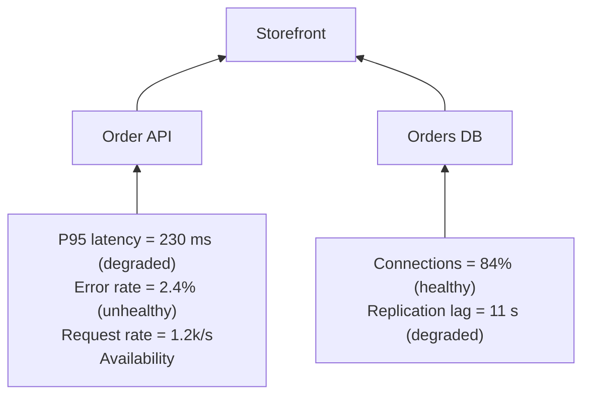
```mermaid
flowchart BT
    apiSig["P95 latency = 230 ms (degraded)<br/>Error rate = 2.4% (unhealthy)<br/>Request rate = 1.2k/s<br/>Availability"] --> api["Order API"]
    dbSig["Connections = 84% (healthy)<br/>Replication lag = 11 s (degraded)"] --> db["Orders DB"]
    api --> root["Storefront"]
    db --> root
    class apiSig,dbSig blue;
    class api amber;
    class db green;
    class root amber;
```
````

</details>

### Relationships and labels

`-->` is a roll-up, `-->|label|` a labeled roll-up and `-. "label" .->` a dashed one (limited or
suppressed propagation). Each connector takes its **source** entity's state color; grey connector
strokes are used only for unknown-state sources. Give dashed edges a label: the swimlane parser
does not read an unlabeled `-.->`.

**Swimlane look (default)**

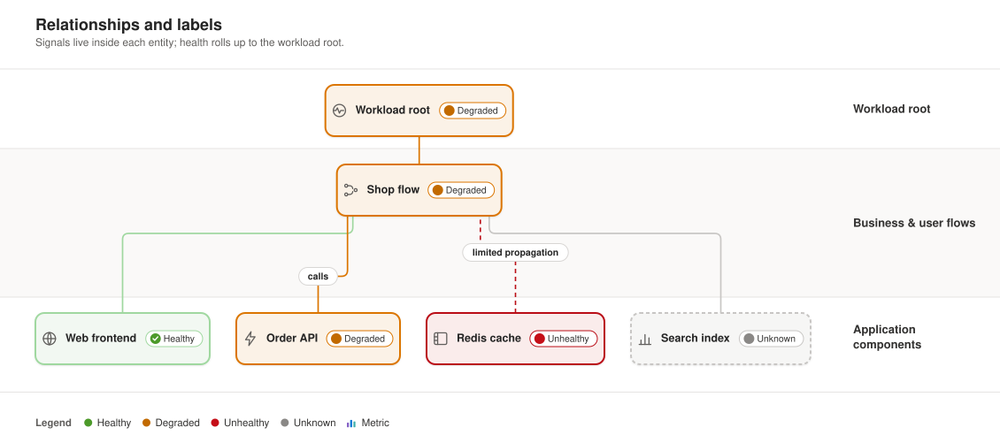

**Pele look (`-r pele`)**

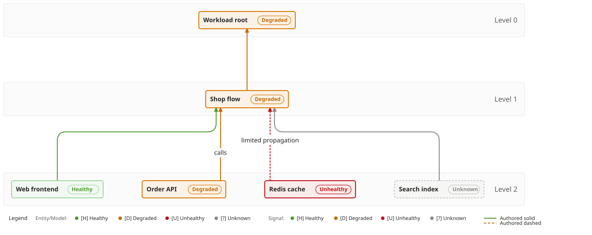

<details><summary>Source</summary>

````markdown
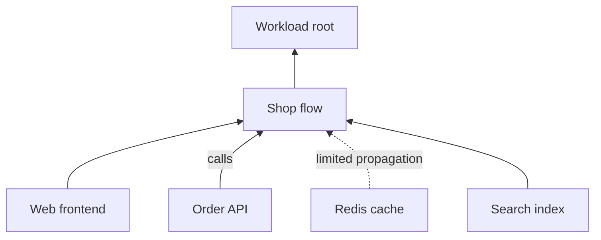
```mermaid
flowchart BT
    web["Web frontend"] --> shop["Shop flow"]
    api["Order API"] -->|calls| shop
    cache["Redis cache"] -. "limited propagation" .-> shop
    search["Search index"] --> shop
    shop --> root["Workload root"]
    class web green;
    class api amber;
    class cache red;
    class shop amber;
    class root amber;
```
````

</details>

### Qualifiers

A label line in parentheses, such as `(worstOf)`, `(active-active)` or `(single region)`, becomes
the card's subtitle.

**Swimlane look (default)**

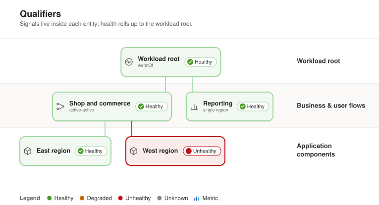

**Pele look (`-r pele`)**

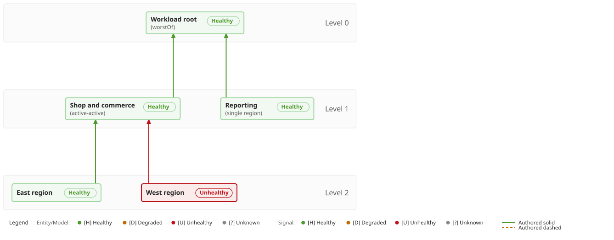

<details><summary>Source</summary>

````markdown
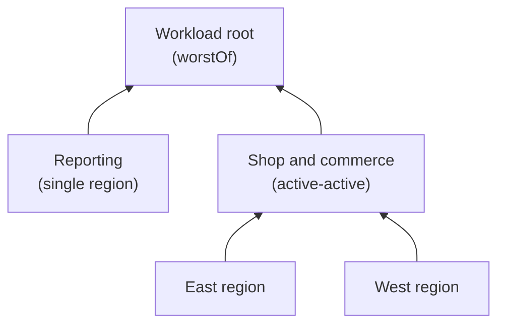
```mermaid
flowchart BT
    east["East region"] --> shop["Shop and commerce<br/>(active-active)"]
    west["West region"] --> shop
    rep["Reporting<br/>(single region)"] --> root["Workload root<br/>(worstOf)"]
    shop --> root
    class east green;
    class west red;
    class shop green;
    class rep green;
    class root green;
```
````

</details>

### Deep models

Lanes follow roll-up depth. An edge may skip lanes; it routes through the gaps between cards.

**Swimlane look (default)**

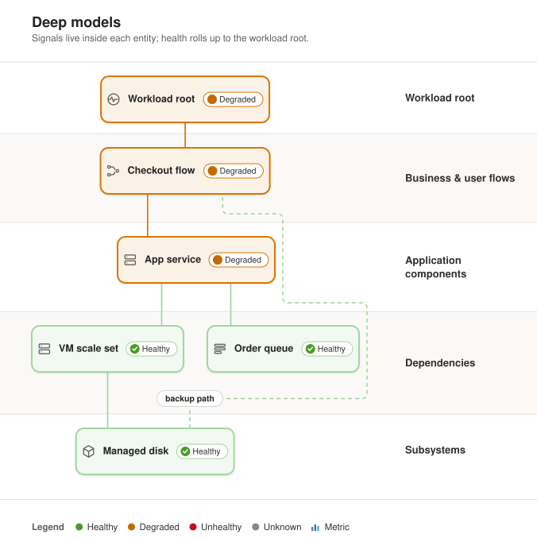

**Pele look (`-r pele`)**

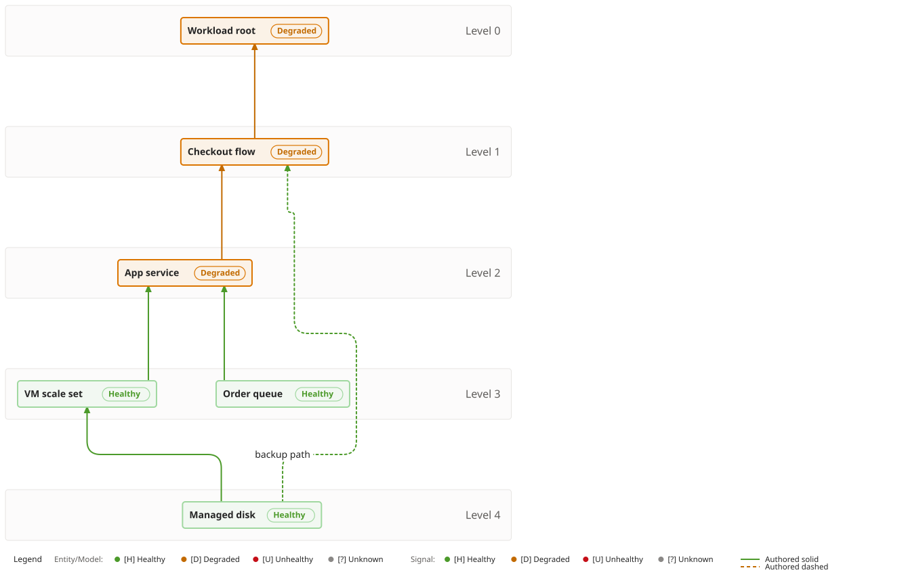

<details><summary>Source</summary>

````markdown
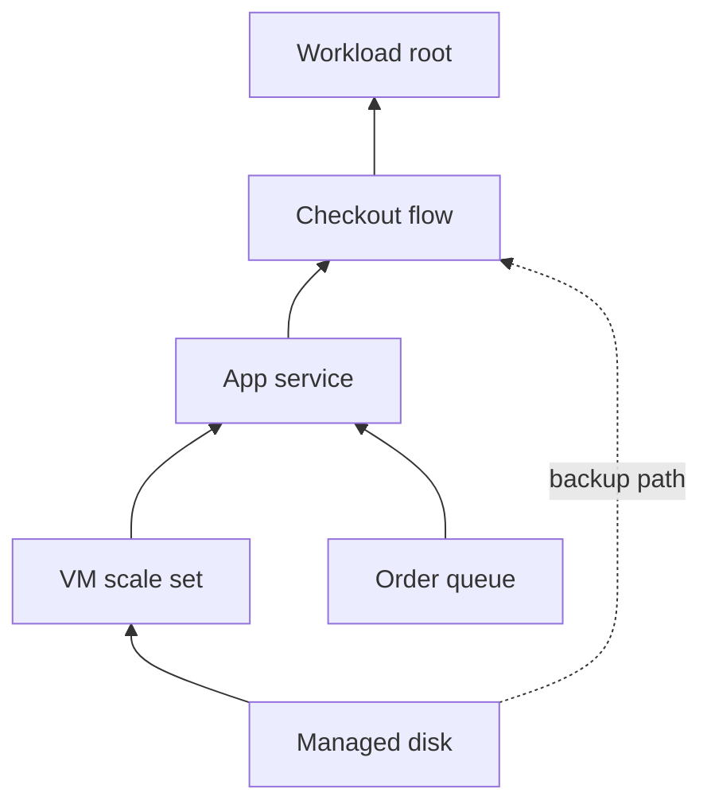
```mermaid
flowchart BT
    disk["Managed disk"] --> vm["VM scale set"]
    vm --> app["App service"]
    queue["Order queue"] --> app
    app --> checkout["Checkout flow"]
    checkout --> root["Workload root"]
    disk -. "backup path" .-> checkout
    class disk,vm,queue green;
    class app amber;
    class checkout amber;
    class root amber;
```
````

</details>

### Many labeled relationships

Labels sit in pills that never overlap each other or cross a card, however many relationships
converge on one parent.

**Swimlane look (default)**

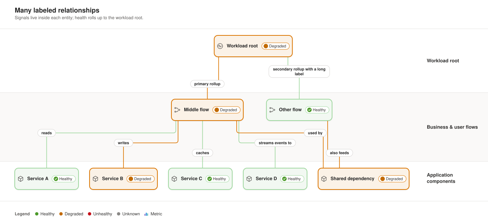

**Pele look (`-r pele`)**

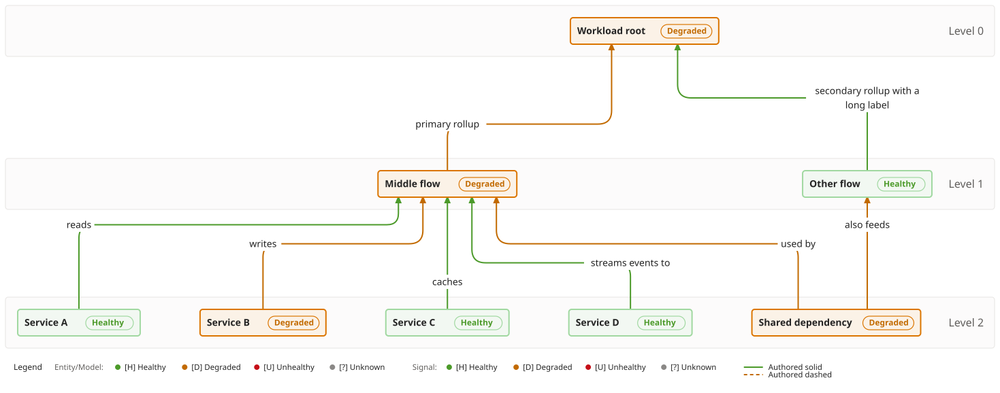

<details><summary>Source</summary>

````markdown
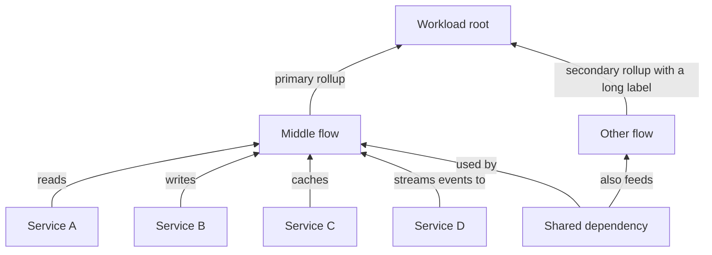
```mermaid
flowchart BT
    a["Service A"] -->|reads| mid["Middle flow"]
    b["Service B"] -->|writes| mid
    c["Service C"] -->|caches| mid
    d["Service D"] -->|streams events to| mid
    shared["Shared dependency"] -->|used by| mid
    shared -->|also feeds| other["Other flow"]
    mid -->|primary rollup| root["Workload root"]
    other -->|secondary rollup with a long label| root
    class a,c,d green;
    class b amber;
    class shared amber;
    class mid amber;
    class other green;
    class root amber;
```
````

</details>

### Long names and Unicode

Names wrap instead of being cut off, and any Unicode text renders as native SVG text.

**Swimlane look (default)**

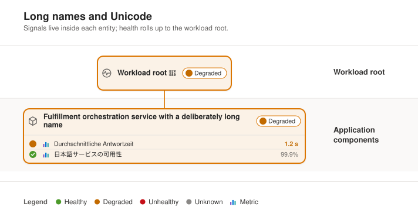

**Pele look (`-r pele`)**

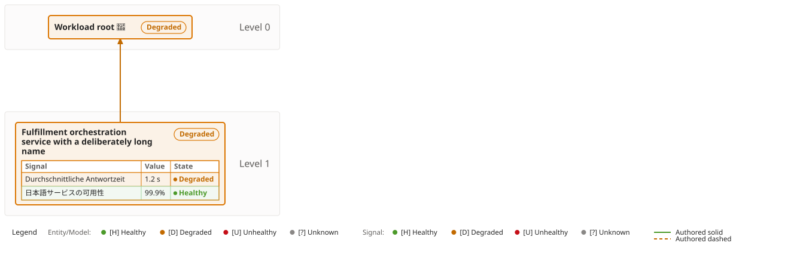

<details><summary>Source</summary>

````markdown
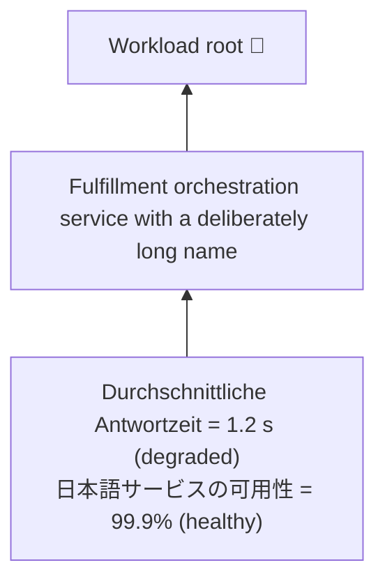
```mermaid
flowchart BT
    sig["Durchschnittliche Antwortzeit = 1.2 s (degraded)<br/>日本語サービスの可用性 = 99.9% (healthy)"] --> svc["Fulfillment orchestration service with a deliberately long name"]
    svc --> root["Workload root 🚀"]
    class sig blue;
    class svc amber;
    class root amber;
```
````

</details>

## Themes

Four themes, shared by both looks and by every other diagram type: `portal` (default),
`midnight`, `candy` and `slate`. Set one per run with `-t` or per block, for example in the fence
line: ` ```mermaid midnight `.

### Theme: portal

**Swimlane look (default)**

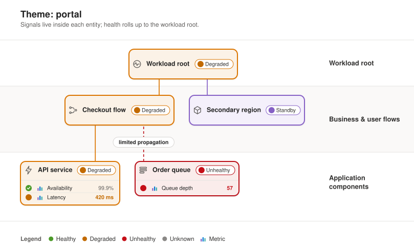

**Pele look (`-r pele`)**

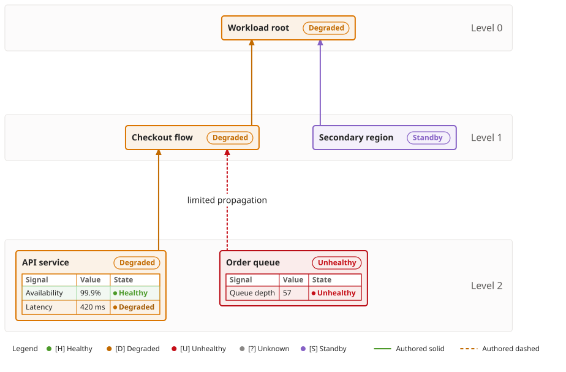

<details><summary>Source</summary>

````markdown
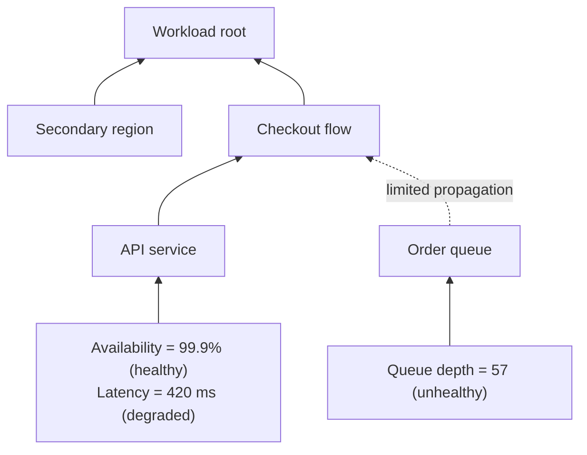
```mermaid
flowchart BT
    sigA["Availability = 99.9% (healthy)<br/>Latency = 420 ms (degraded)"] --> api["API service"]
    sigB["Queue depth = 57 (unhealthy)"] --> queue["Order queue"]
    api --> flow["Checkout flow"]
    queue -. "limited propagation" .-> flow
    standby["Secondary region"] --> root["Workload root"]
    flow --> root
    class sigA,sigB blue;
    class api amber;
    class queue red;
    class flow amber;
    class standby purple;
    class root amber;
```
````

</details>

### Theme: midnight

**Swimlane look (default)**

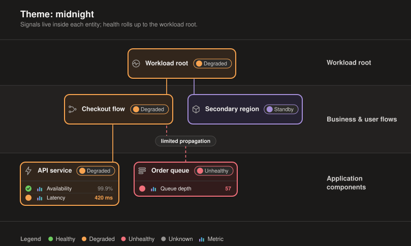

**Pele look (`-r pele`)**

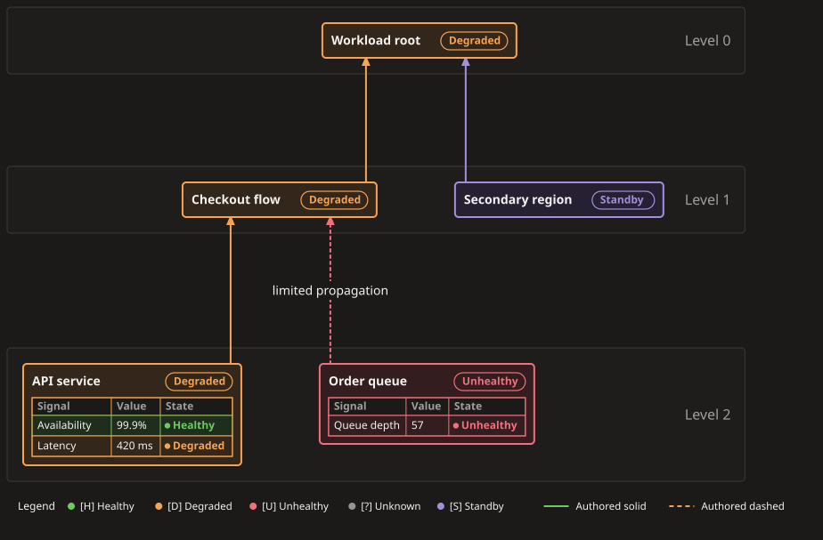

<details><summary>Source</summary>

````markdown

```mermaid midnight
flowchart BT
    sigA["Availability = 99.9% (healthy)<br/>Latency = 420 ms (degraded)"] --> api["API service"]
    sigB["Queue depth = 57 (unhealthy)"] --> queue["Order queue"]
    api --> flow["Checkout flow"]
    queue -. "limited propagation" .-> flow
    standby["Secondary region"] --> root["Workload root"]
    flow --> root
    class sigA,sigB blue;
    class api amber;
    class queue red;
    class flow amber;
    class standby purple;
    class root amber;
```
````

</details>

### Theme: candy

**Swimlane look (default)**

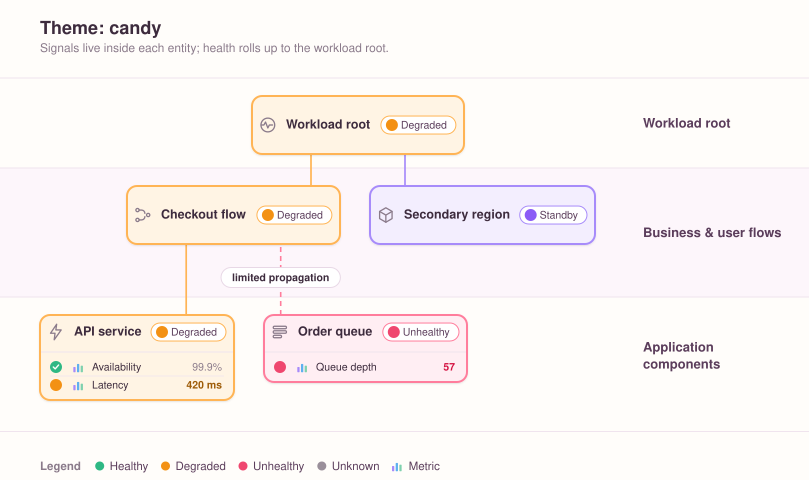

**Pele look (`-r pele`)**

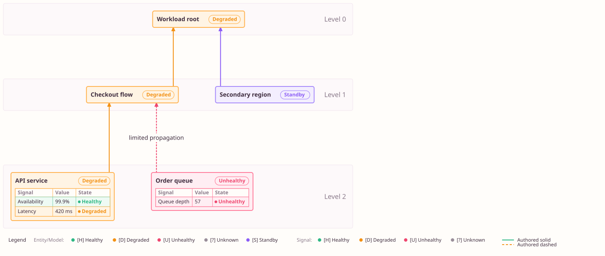

<details><summary>Source</summary>

````markdown

```mermaid candy
flowchart BT
    sigA["Availability = 99.9% (healthy)<br/>Latency = 420 ms (degraded)"] --> api["API service"]
    sigB["Queue depth = 57 (unhealthy)"] --> queue["Order queue"]
    api --> flow["Checkout flow"]
    queue -. "limited propagation" .-> flow
    standby["Secondary region"] --> root["Workload root"]
    flow --> root
    class sigA,sigB blue;
    class api amber;
    class queue red;
    class flow amber;
    class standby purple;
    class root amber;
```
````

</details>

### Theme: slate

**Swimlane look (default)**

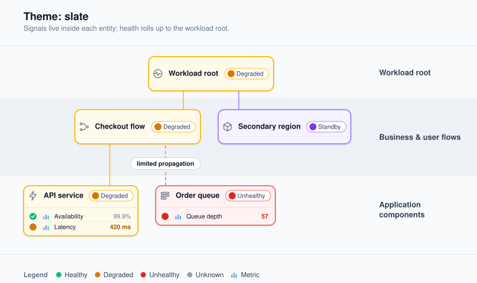

**Pele look (`-r pele`)**

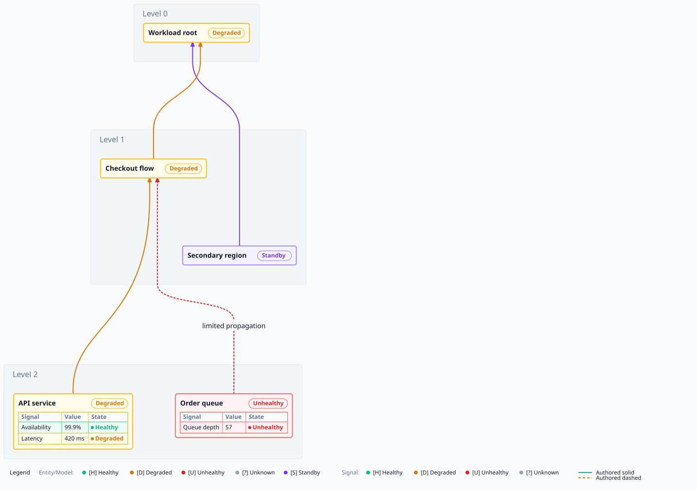

<details><summary>Source</summary>

````markdown

```mermaid slate
flowchart BT
    sigA["Availability = 99.9% (healthy)<br/>Latency = 420 ms (degraded)"] --> api["API service"]
    sigB["Queue depth = 57 (unhealthy)"] --> queue["Order queue"]
    api --> flow["Checkout flow"]
    queue -. "limited propagation" .-> flow
    standby["Secondary region"] --> root["Workload root"]
    flow --> root
    class sigA,sigB blue;
    class api amber;
    class queue red;
    class flow amber;
    class standby purple;
    class root amber;
```
````

</details>

## Options

Options reach a block three ways, all invisible to GitHub's Mermaid preview; later ones win:
the fence line (` ```mermaid midnight title="Checkout" `), YAML frontmatter (Mermaid's own
`title:` plus a `diagrammo:` key) and `%%|` directive comments. `theme` and `legend` apply to both
looks; `title`, `subtitle`, `lanes` and `laneLabels` shape the swimlane look only.

### Title and subtitle

The swimlane look draws a header from `title` (default: the nearest Markdown heading) and
`subtitle`.

**Swimlane look (default)**

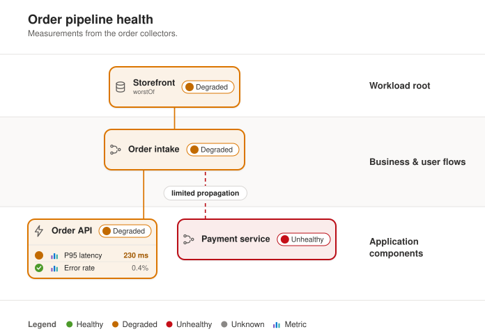

**Pele look (`-r pele`)**

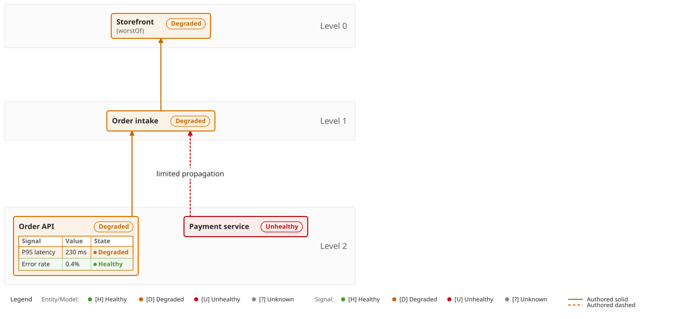

<details><summary>Source</summary>

````markdown
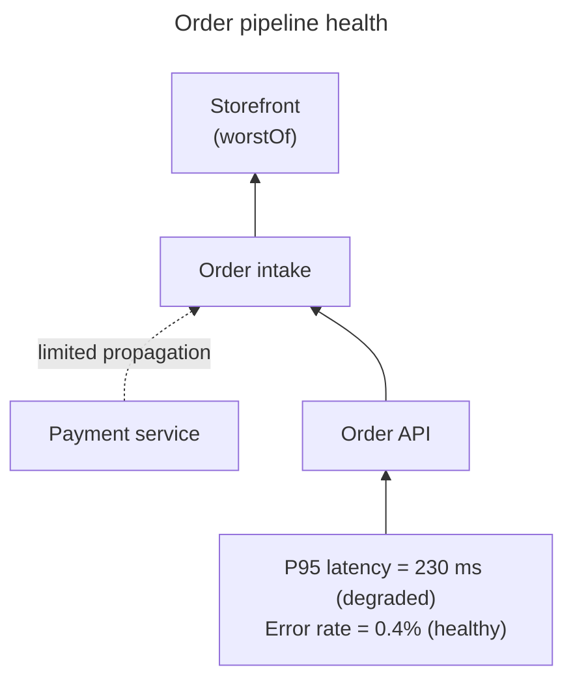
```mermaid
---
title: Order pipeline health
diagrammo:
  subtitle: Measurements from the order collectors.
---
flowchart BT
    apiSig["P95 latency = 230 ms (degraded)<br/>Error rate = 0.4% (healthy)"] --> api["Order API"]
    payment["Payment service"] -. "limited propagation" .-> orders["Order intake"]
    api --> orders
    orders --> root["Storefront<br/>(worstOf)"]
    class apiSig blue;
    class api amber;
    class payment red;
    class orders amber;
    class root amber;
```
````

</details>

### Lane names

`lanes` names the swimlane rows from top to bottom.

**Swimlane look (default)**

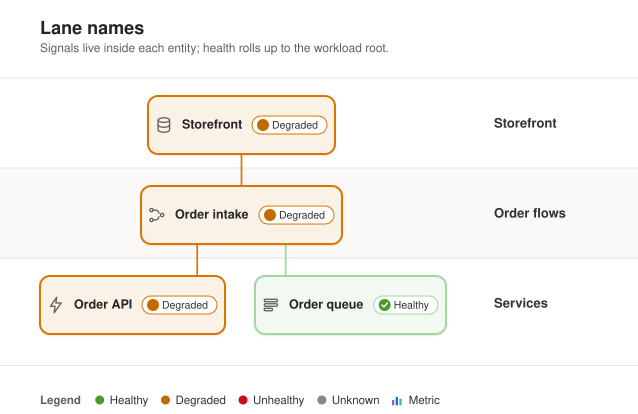

**Pele look (`-r pele`)**

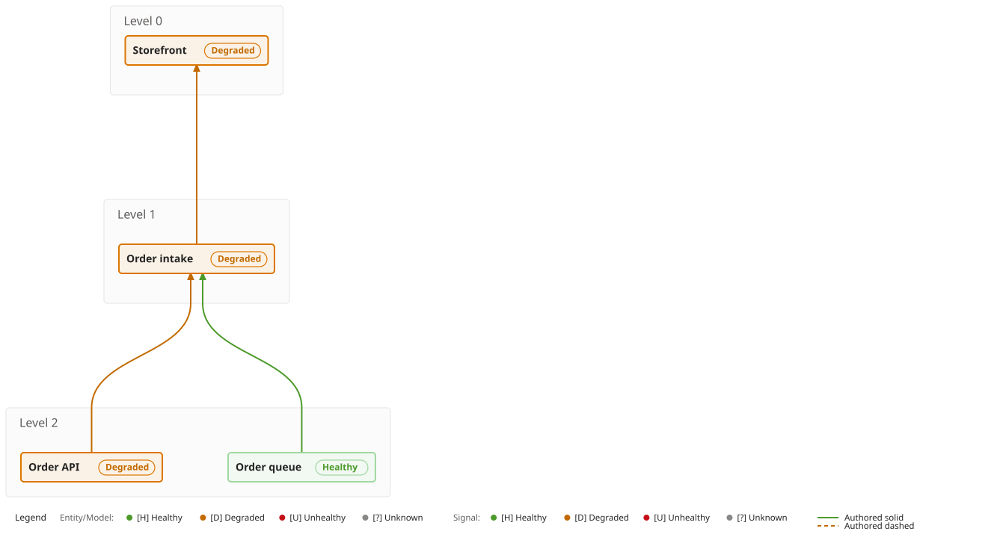

<details><summary>Source</summary>

````markdown
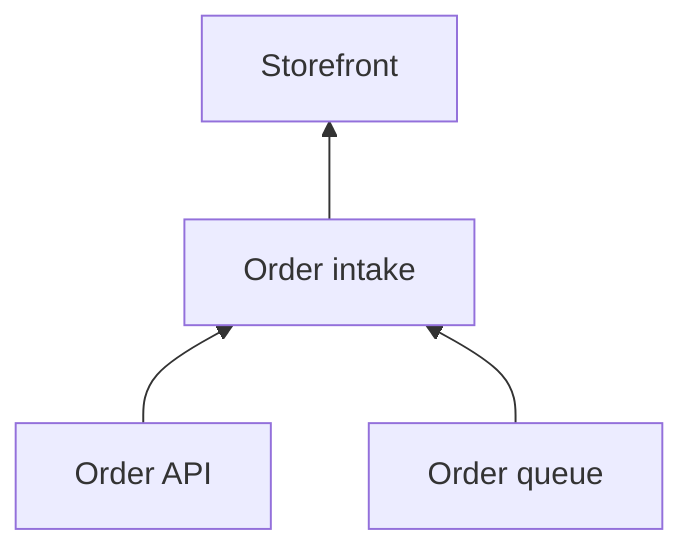
```mermaid
---
diagrammo:
  lanes: [Storefront, Order flows, Services]
---
flowchart BT
    api["Order API"] --> orders["Order intake"]
    queue["Order queue"] --> orders
    orders --> root["Storefront"]
    class api amber;
    class queue green;
    class orders amber;
    class root amber;
```
````

</details>

### Legend off

**Swimlane look (default)**

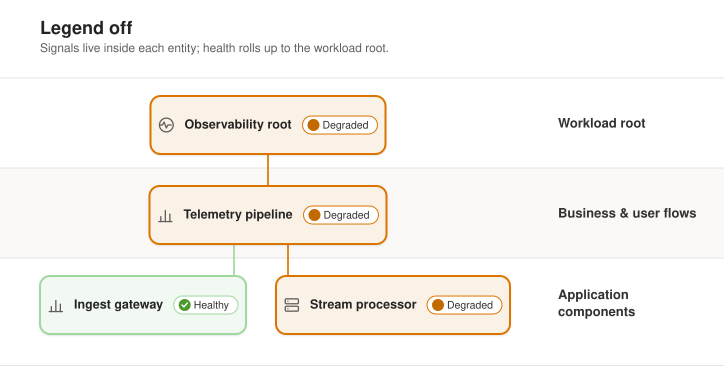

**Pele look (`-r pele`)**

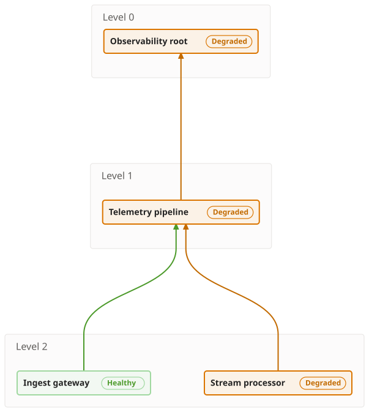

<details><summary>Source</summary>

````markdown
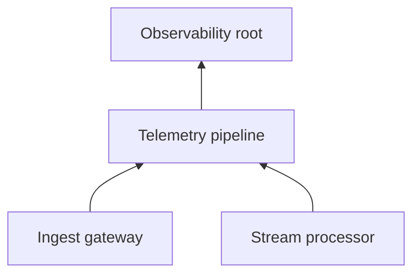
```mermaid
%%| legend: false
flowchart BT
    ingest["Ingest gateway"] --> pipeline["Telemetry pipeline"]
    proc["Stream processor"] --> pipeline
    pipeline --> root["Observability root"]
    class ingest green;
    class proc amber;
    class pipeline amber;
    class root amber;
```
````

</details>

### Lane labels off

`laneLabels: false` hides the lane names in the swimlane look and reclaims their gutter; the
lane bands stay.

**Swimlane look (default)**

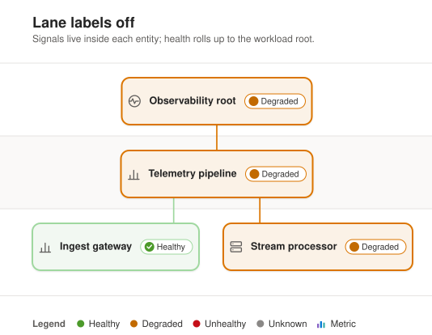

**Pele look (`-r pele`)**

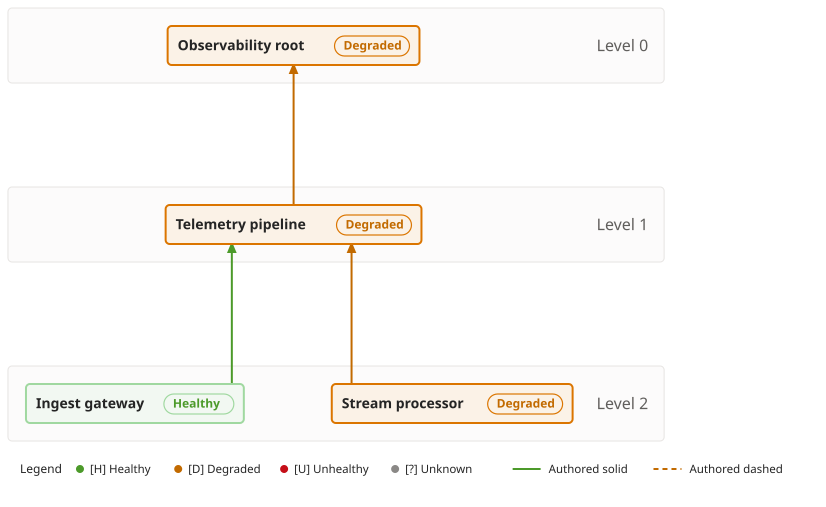

<details><summary>Source</summary>

````markdown

```mermaid
%%| laneLabels: false
flowchart BT
    ingest["Ingest gateway"] --> pipeline["Telemetry pipeline"]
    proc["Stream processor"] --> pipeline
    pipeline --> root["Observability root"]
    class ingest green;
    class proc amber;
    class pipeline amber;
    class root amber;
```
````

</details>

### Plain Mermaid look

`renderer: mermaid` keeps Mermaid's own shapes for a health model, in the block's theme, with the
health classes mapped to the theme's state colors. This is a third look, so it has one image.

**Pele, plain Mermaid shapes**

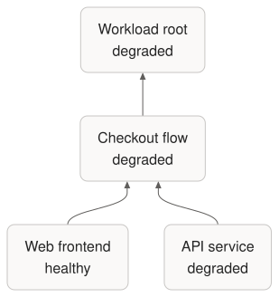

<details><summary>Source</summary>

````markdown
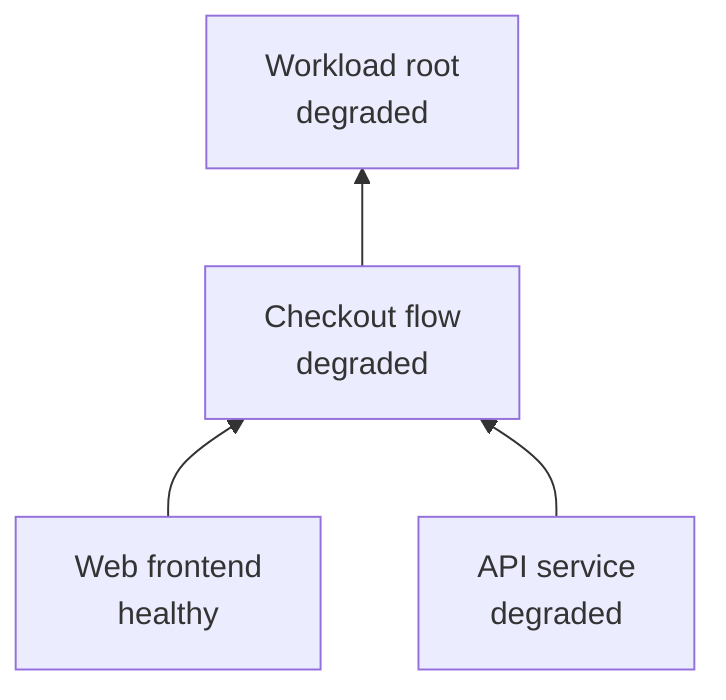
```mermaid
%%| renderer: mermaid
flowchart BT
    web["Web frontend<br/>healthy"] --> checkout["Checkout flow<br/>degraded"]
    api["API service<br/>degraded"] --> checkout
    checkout --> root["Workload root<br/>degraded"]
    class web green;
    class api,checkout,root amber;
```
````

</details>

## Other Mermaid diagrams

Anything that is not a health model is rendered by Pele in the block's theme, whichever look was
requested, so each of these has one image. Every diagram type Mermaid supports works.

### Flowchart

**Pele, plain Mermaid shapes**

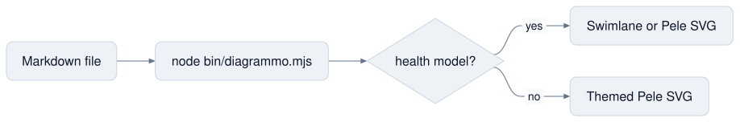

<details><summary>Source</summary>

````markdown
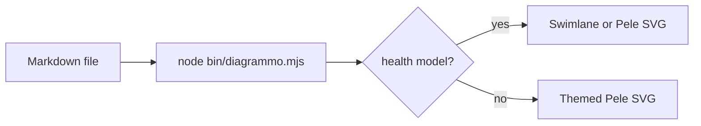
```mermaid slate
flowchart LR
    md[Markdown file] --> cli[node bin/diagrammo.mjs]
    cli --> auto{health model?}
    auto -- yes --> ahm[Swimlane or Pele SVG]
    auto -- no --> plain[Themed Pele SVG]
```
````

</details>

### Sequence diagram

**Pele, plain Mermaid shapes**

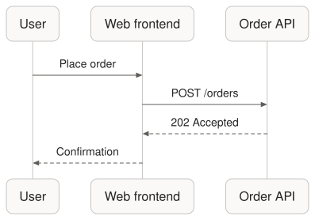

<details><summary>Source</summary>

````markdown
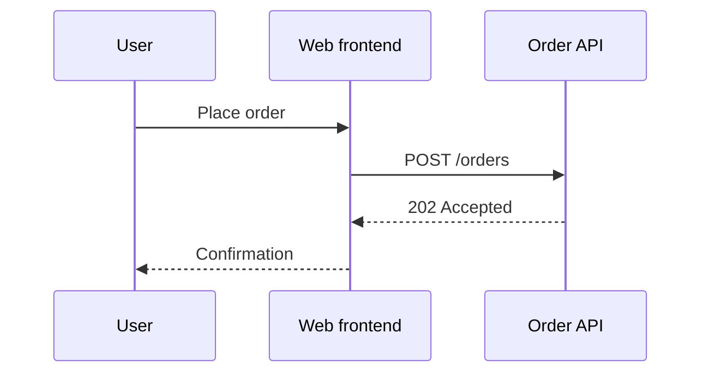
```mermaid
sequenceDiagram
    participant U as User
    participant W as Web frontend
    participant A as Order API
    U->>W: Place order
    W->>A: POST /orders
    A-->>W: 202 Accepted
    W-->>U: Confirmation
```
````

</details>

### State diagram

**Pele, plain Mermaid shapes**

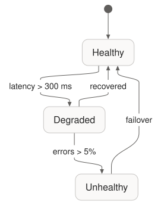

<details><summary>Source</summary>

````markdown
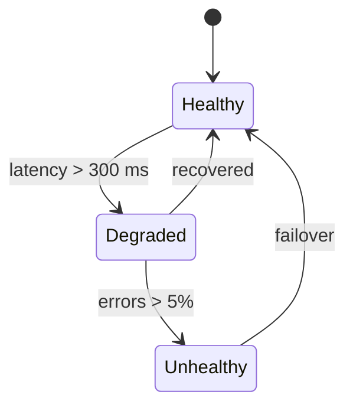
```mermaid
stateDiagram-v2
    [*] --> Healthy
    Healthy --> Degraded: latency > 300 ms
    Degraded --> Unhealthy: errors > 5%
    Degraded --> Healthy: recovered
    Unhealthy --> Healthy: failover
```
````

</details>

### ER diagram

**Pele, plain Mermaid shapes**

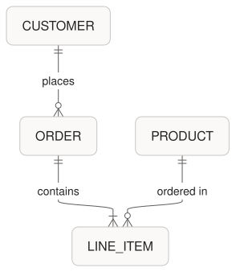

<details><summary>Source</summary>

````markdown
```mermaid
erDiagram
    CUSTOMER ||--o{ ORDER : places
    ORDER ||--|{ LINE_ITEM : contains
    PRODUCT ||--o{ LINE_ITEM : "ordered in"
```
````

</details>

### Pie chart

**Pele, plain Mermaid shapes**

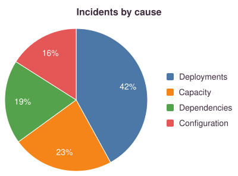

<details><summary>Source</summary>

````markdown
```mermaid candy
pie title Incidents by cause
    "Deployments" : 42
    "Capacity" : 23
    "Dependencies" : 19
    "Configuration" : 16
```
````

</details>

## Pele library options

These options exist only in the library call `renderAhm(source, options)`, so each example has the
Pele look only. The HTML comment above each block holds the options the gallery passes.

### Left-to-right direction

**Pele library · `renderAhm`**

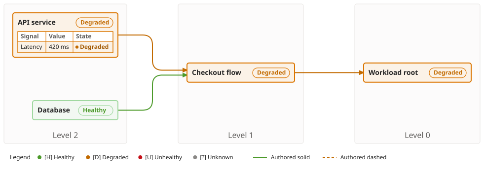

<details><summary>Source</summary>

````markdown
<!-- gallery: renderAhm {"direction": "LR", "lanes": true} -->
```mermaid
flowchart BT
    sig["Latency = 420 ms (degraded)"] --> api["API service"]
    api --> flow["Checkout flow"]
    db["Database"] --> flow
    flow --> root["Workload root"]
    class sig blue;
    class api amber;
    class db green;
    class flow amber;
    class root amber;
```
````

</details>

### Table headers off

**Pele library · `renderAhm`**

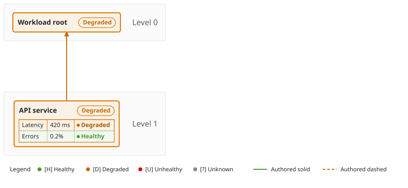

<details><summary>Source</summary>

````markdown
<!-- gallery: renderAhm {"lanes": true, "tableHeaders": false} -->
```mermaid
flowchart BT
    sig["Latency = 420 ms (degraded)<br/>Errors = 0.2% (healthy)"] --> api["API service"]
    api --> root["Workload root"]
    class sig blue;
    class api amber;
    class root amber;
```
````

</details>

### Color overrides

**Pele library · `renderAhm`**

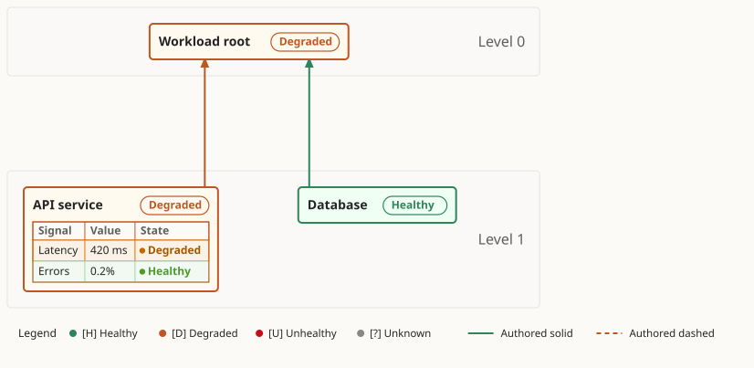

<details><summary>Source</summary>

````markdown
<!-- gallery: renderAhm {"lanes": true, "colors": {"canvas": {"bg": "#fbfaf7"}, "entity": {"healthy": {"border": "#2f855a", "fill": "#f0fff4", "accent": "#2f855a"}, "degraded": {"border": "#c05621", "fill": "#fffaf0", "accent": "#c05621"}}}} -->
```mermaid
flowchart BT
    sig["Latency = 420 ms (degraded)<br/>Errors = 0.2% (healthy)"] --> api["API service"]
    db["Database"] --> root["Workload root"]
    api --> root
    class sig blue;
    class api amber;
    class db green;
    class root amber;
```
````

</details>

### Font size

**Pele library · `renderAhm`**

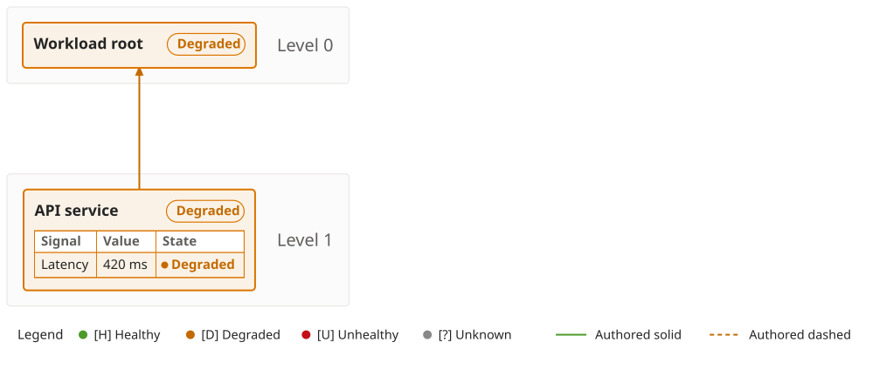

<details><summary>Source</summary>

````markdown
<!-- gallery: renderAhm {"lanes": true, "fontSize": 20} -->
```mermaid
flowchart BT
    sig["Latency = 420 ms (degraded)"] --> api["API service"]
    api --> root["Workload root"]
    class sig blue;
    class api amber;
    class root amber;
```
````

</details>

### Nested models

Subgraphs registered in `nested.models` become models with their own state, shown expanded,
collapsed into one card, or as a detail view of one model.

**expanded · `renderAhm`**

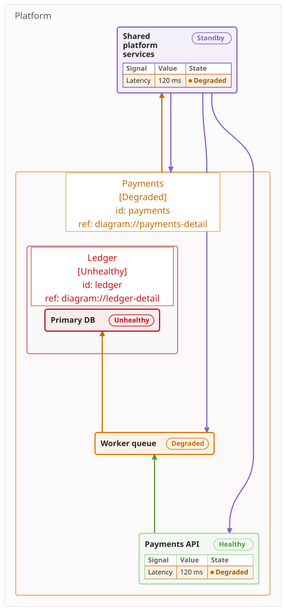

**collapsed · `renderAhm`**

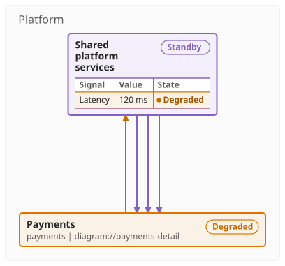

**detail · `renderAhm`**

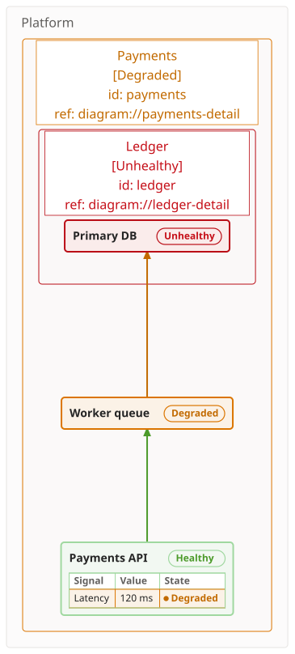

<details><summary>Source</summary>

````markdown
<!-- gallery: renderAhm [{"label": "expanded", "options": {"lanes": true, "legend": false, "nested": {"models": {"payments": {"state": "degraded", "detailRef": "diagram://payments-detail"}, "ledger": {"state": "unhealthy", "detailRef": "diagram://ledger-detail"}}, "view": {"mode": "expanded"}}}}, {"label": "collapsed", "options": {"lanes": true, "legend": false, "nested": {"models": {"payments": {"state": "degraded", "detailRef": "diagram://payments-detail"}, "ledger": {"state": "unhealthy", "detailRef": "diagram://ledger-detail"}}, "view": {"mode": "collapsed"}}}}, {"label": "detail", "options": {"lanes": true, "legend": false, "nested": {"models": {"payments": {"state": "degraded", "detailRef": "diagram://payments-detail"}, "ledger": {"state": "unhealthy", "detailRef": "diagram://ledger-detail"}}, "view": {"mode": "detail", "detailFocus": "payments"}}}}] -->
```mermaid
flowchart BT
subgraph platform["Platform"]
subgraph payments["Payments"]
api["Payments API"]
worker["Worker queue"]
subgraph ledger["Ledger"]
db["Primary DB"]
end
end
infra["Shared platform services"]
end
shared["Latency = 120 ms (degraded)"]:::blue
shared --> api
shared --> infra
payments --> infra
infra --> payments
api --> worker
worker --> db
infra --> api
infra --> worker
class api healthy;
class worker degraded;
class db unhealthy;
class infra standby;
```
````

</details>
