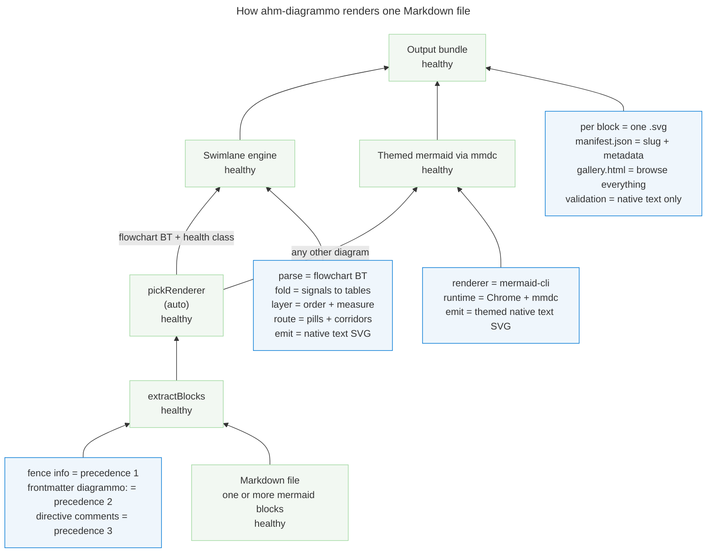

# How ahm-diagrammo works

This page explains the tool with the tool. The figure below is a health model that
ahm-diagrammo renders of its own pipeline, so what you read here is what the swimlane
engine actually draws.

Regenerate the figure from this file:

```bash
npx ahm-diagrammo docs/how-it-works.md -o docs/assets
```

That writes `docs/assets/how-it-works-pipeline.svg` (plus a `manifest.json` and
`gallery.html`). This page and the README embed only the SVG.

## The pipeline, as a health model

Read it bottom-up, the way the swimlane engine rolls state toward the root. A Markdown
file enters at the bottom; the output bundle sits at the top. Four signal tables explain the
pipeline: option channels fold into extraction, renderer requirements fold into each renderer,
swimlane stages fold into the swimlane engine, and artifacts fold into the output bundle.



## What each lane shows

| Lane | Stage | Code | Verified by |
|------|-------|------|-------------|
| Markdown input | Read the file, find every ` ```mermaid ` fence | `extractBlocks` in `src/extract.mjs` | `extract.test.mjs`; `docs.test.mjs` |
| Extraction | Merge options from three channels, validate keys and values | `buildBlock` in `src/extract.mjs` | `extract.test.mjs` — option merge, precedence, issues |
| Selection | Pick the renderer: a `flowchart BT` with a health class goes to swimlane, everything else to mermaid | `pickRenderer` in `bin/diagrammo.mjs`, `looksLikeHealthModel` in `src/swimlane.mjs` | `swimlane.test.mjs` — "looksLikeHealthModel detects health flowcharts only" |
| Renderers | Draw the SVG: the pure-Node swimlane engine, or themed mermaid through `mmdc` | `renderSwimlane` in `src/swimlane.mjs`, `renderMermaid` in `src/mermaid.mjs` | `swimlane.test.mjs`; `mermaid.test.mjs` |
| Output bundle | Write one SVG per block, `manifest.json`, and `gallery.html` | `bin/diagrammo.mjs`, `galleryHtml` in `src/gallery.mjs` | `cli.test.mjs`; `docs.test.mjs` — "gallery.html lists every rendered diagram" |

The three signal channels merge with later channels winning: **fence info < frontmatter
`diagrammo:` < `%%|` directives**. See [FEATURES.md](FEATURES.md#per-block-options) for the
full option table and [FEATURES.md](FEATURES.md#renderer-selection) for the selection rule.

`docs.test.mjs` verifies that the source regenerates cleanly and that the committed SVG
ships under `docs/`, uses native text, and appears in the documentation.
