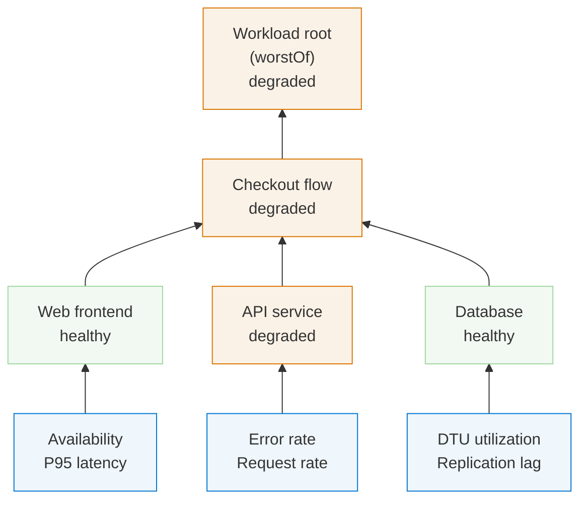
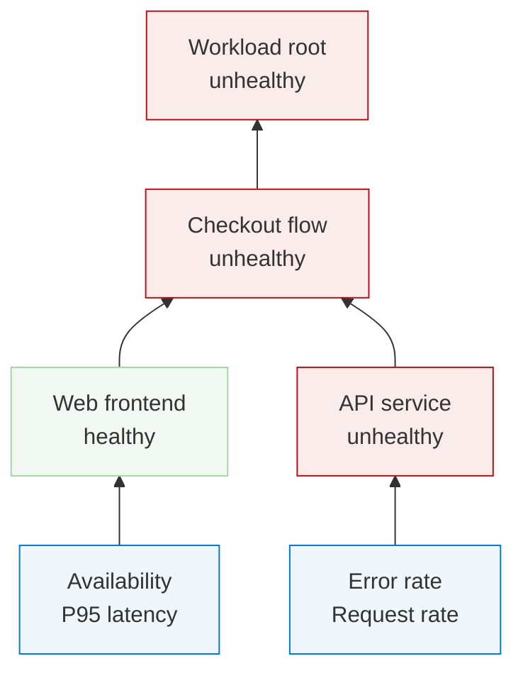
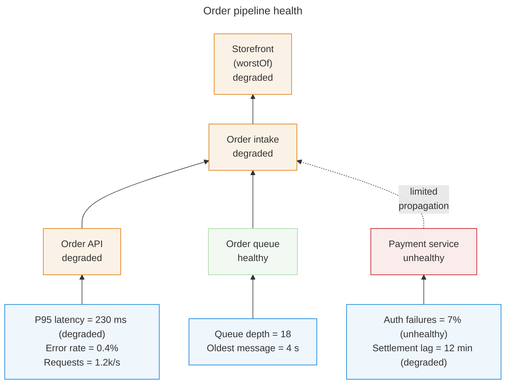
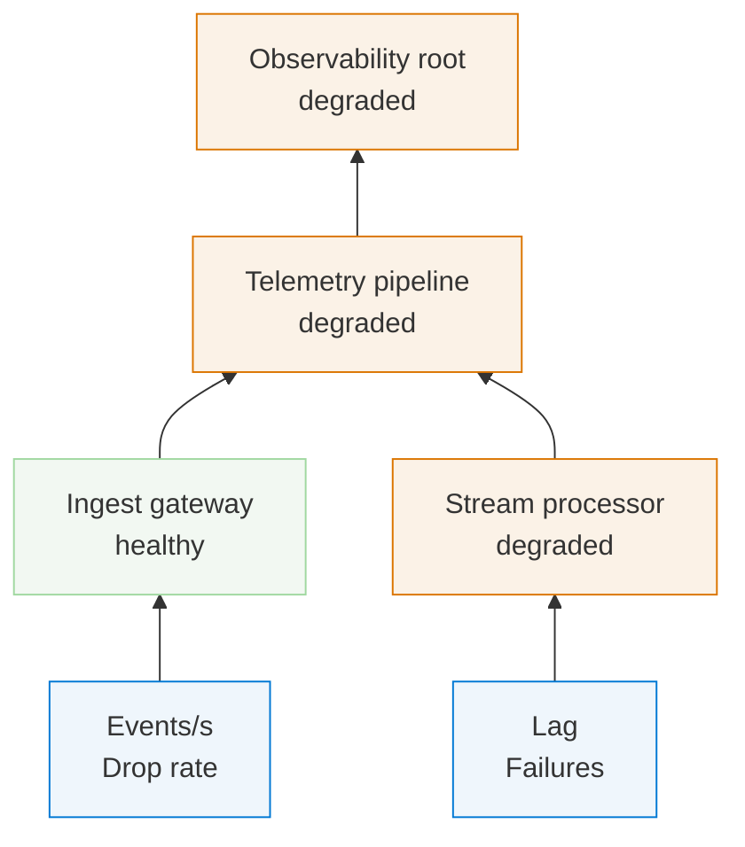
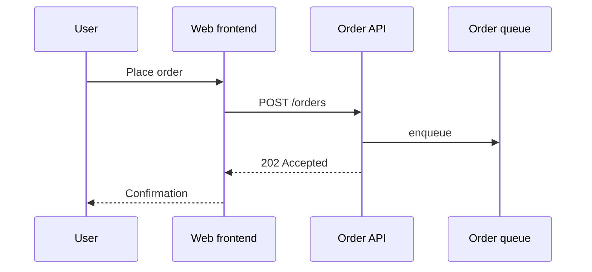
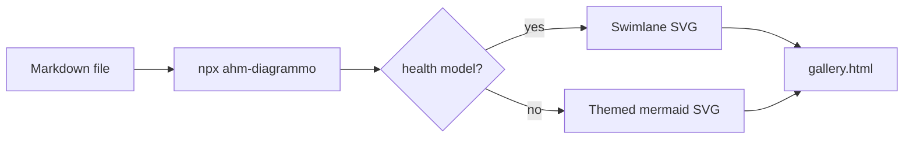

# diagrammo showcase

Run `npx ahm-diagrammo examples/showcase.md -o out-showcase` and open `out-showcase/gallery.html`.
Every block below is plain mermaid — GitHub and VS Code still preview it — but each one carries
diagrammo options a different way.

## Health model, zero config

A `flowchart BT` with the health classes is auto-detected and rendered as a portal-style swimlane.



## Fence-info options: theme in the fence line

Same model, midnight theme — the fence reads ` ```mermaid midnight `. GitHub only looks at the
first word of the info string, so its preview is untouched.



## YAML frontmatter: title, lanes, real measurements

Mermaid itself understands the frontmatter block, so previews keep working; diagrammo reads the
`diagrammo:` key. Signal rows can carry their own result and state: `name = value (state)`.



## Directive comments: `%%|` lines

Directives are mermaid comments, so they never show up anywhere else.



## Any other mermaid still works

Everything that isn't a health model goes through mermaid-cli with the same theme, so a whole
document stays visually consistent. Sequence diagrams, state machines, plain flowcharts, ER —
whatever mermaid can draw.



## Plain flowchart, forced theme


