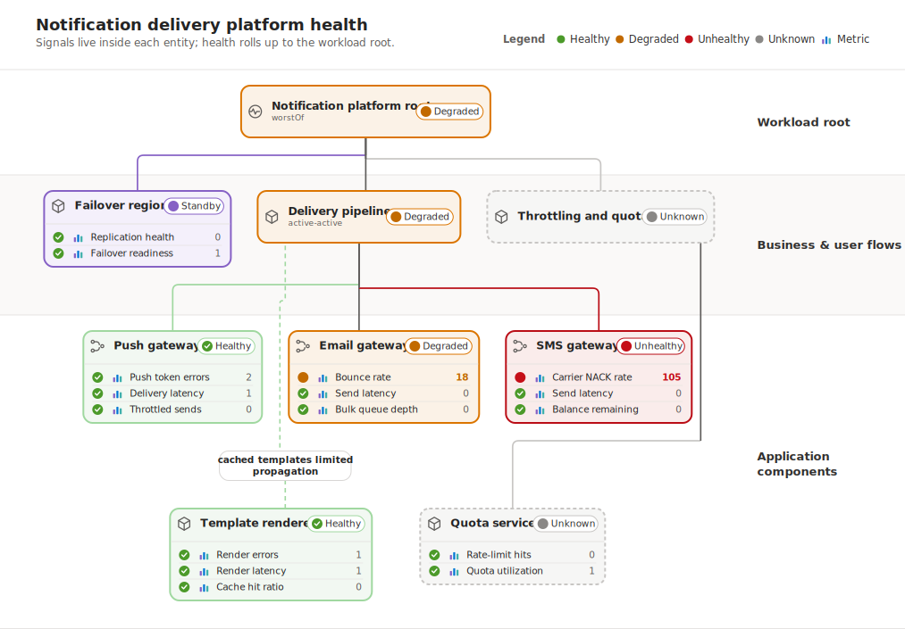

# Sync-markdown example

This folder is a real, already-synced specimen of `--sync-markdown` — not a screenshot, not a
hand-typed snippet. The Markdown below has actually been run through the current CLI, in place.

**Rendered viewers** (GitHub's file view, VS Code's Markdown preview) see only a real SVG ``
for the diagram — the Mermaid source is fully hidden, not merely collapsed, inside an HTML
comment. **Raw editors** (opening this file to make a change) see exactly what they'd expect: a
plain ` ```mermaid ` fence — its `-->` terminators escaped to `--&gt;` so the wrapping comment
never ends early — just wrapped in a machine-owned managed block that stays in sync.

To regenerate it yourself, from this folder:

```bash
node ../../bin/diagrammo.mjs README.md -o assets --sync-markdown --no-gallery
```

The general/published-package equivalent (documented for reference — not independently resolved
against a live registry in this session, unlike the command above):

```bash
npx ahm-diagrammo README.md -o assets --sync-markdown --no-gallery
```

Reruns are idempotent: nothing changes if the fence hasn't.

## Notification delivery platform health

<!-- diagrammo:sync notification-delivery-platform-health -->


<!-- diagrammo:source
```mermaid
flowchart BT
    pushSig["Push token errors<br/>Delivery latency<br/>Throttled sends"] --&gt; pushGw["Push gateway<br/>healthy"]
    emailSig["Bounce rate<br/>Send latency<br/>Bulk queue depth"] --&gt; emailGw["Email gateway<br/>degraded"]
    smsSig["Carrier NACK rate<br/>Send latency<br/>Balance remaining"] --&gt; smsGw["SMS gateway<br/>unhealthy"]
    tmplSig["Render errors<br/>Render latency<br/>Cache hit ratio"] --&gt; renderer["Template renderer<br/>healthy"]
    quotaSig["Rate-limit hits<br/>Quota utilization"] --&gt; quota["Quota service"]
    secSig["Replication health<br/>Failover readiness"] --&gt; failover["Failover region<br/>standby"]

    pushGw --&gt; delivery["Delivery pipeline<br/>(active-active)<br/>degraded"]
    emailGw --&gt; delivery
    smsGw --&gt; delivery
    renderer -. "cached templates<br/>limited propagation" .-> delivery
    quota --&gt; throttling["Throttling and quotas"]

    delivery --&gt; root["Notification platform root<br/>(worstOf)<br/>degraded"]
    throttling --&gt; root
    failover --&gt; root

    classDef blue fill:#eff6fc,stroke:#0078D4;
    classDef green fill:#f2f8f2,stroke:#a0d8a0;
    classDef amber fill:#fbf2e7,stroke:#db7500;
    classDef red fill:#faeceb,stroke:#ba0d16;
    classDef purple fill:#f4f0fb,stroke:#8661c5;
    class pushSig,emailSig,smsSig,tmplSig,quotaSig,secSig blue;
    class pushGw,renderer green;
    class emailGw,delivery,root amber;
    class smsGw red;
    class failover purple;
```
-->
<!-- /diagrammo:sync notification-delivery-platform-health -->
