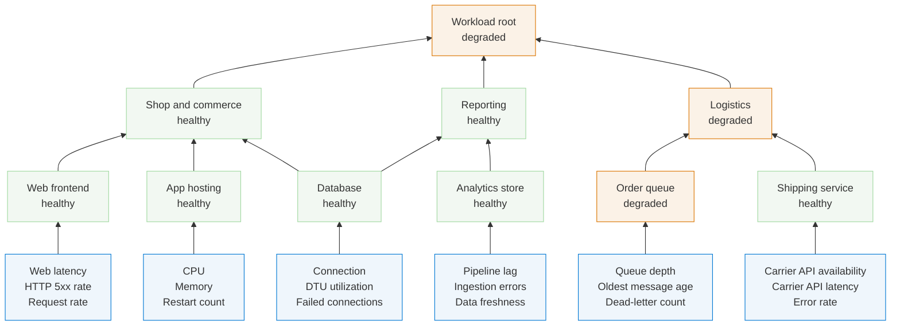

**README's hero figure** — the lead image under `## Examples`. Recreated as editable Mermaid
after the original hero screenshot (a now-removed PNG, replaced by this file + `svg/hero.svg`)
was found to depict a materially different 10-entity "Workload root" shop model, not the 5-node
`why-not-just-vanilla-mermaid` diagram it had been deduplicated with. No Mermaid source for it was
ever committed; the exact node/edge/label/state graph below is reconstructed from the deleted
hand-authored `swimlane.mjs` (git history, commit `914d07a`, comment `model (hero: shop
workload)`) and cross-checked against the original screenshot pixel-for-pixel, including its
auto-generated per-metric numbers. Left without a heading on purpose, so the rendered
title/subtitle stay the renderer's own defaults — exactly what the original screenshot shows.

Regenerate: `node bin/diagrammo.mjs hero.md -o <dir> --no-gallery`, then copy the emitted SVG over
`svg/hero.svg`.

