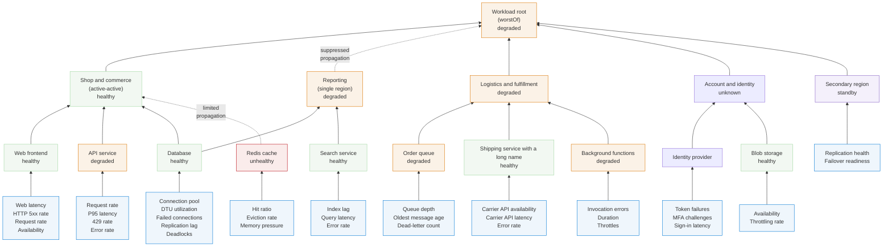

## Kitchen sink health model

A synthetic health model that exercises every feature of the swimlane renderer.

```mermaid
flowchart BT
    %% ---- signals (blue), multi-metric so tables have many rows ----
    webSig["Web latency<br/>HTTP 5xx rate<br/>Request rate<br/>Availability"] --> web["Web frontend<br/>healthy"]
    apiSig["Request rate<br/>P95 latency<br/>429 rate<br/>Error rate"] --> api["API service<br/>degraded"]
    dbSig["Connection pool<br/>DTU utilization<br/>Failed connections<br/>Replication lag<br/>Deadlocks"] --> db["Database<br/>healthy"]
    cacheSig["Hit ratio<br/>Eviction rate<br/>Memory pressure"] --> cache["Redis cache<br/>unhealthy"]
    queueSig["Queue depth<br/>Oldest message age<br/>Dead-letter count"] --> queue["Order queue<br/>degraded"]
    stgSig["Availability<br/>Throttling rate"] --> stg["Blob storage<br/>healthy"]
    authSig["Token failures<br/>MFA challenges<br/>Sign-in latency"] --> auth["Identity provider"]
    searchSig["Index lag<br/>Query latency<br/>Error rate"] --> search["Search service<br/>healthy"]
    shipSig["Carrier API availability<br/>Carrier API latency<br/>Error rate"] --> ship["Shipping service with a long name<br/>healthy"]
    fnSig["Invocation errors<br/>Duration<br/>Throttles"] --> fn["Background functions<br/>degraded"]

    %% ---- components -> business flows ----
    web --> shop["Shop and commerce<br/>(active-active)<br/>healthy"]
    api --> shop
    db --> shop
    cache -. "limited<br/>propagation" .-> shop

    db --> reporting["Reporting<br/>(single region)<br/>degraded"]
    search --> reporting

    queue --> logistics["Logistics and fulfillment<br/>degraded"]
    ship --> logistics
    fn --> logistics

    auth --> account["Account and identity<br/>unknown"]
    stg --> account

    %% ---- standby (purple) ----
    secSig["Replication health<br/>Failover readiness"] --> secondary["Secondary region<br/>standby"]

    %% ---- flows -> root ----
    shop --> root["Workload root<br/>(worstOf)<br/>degraded"]
    reporting -. "suppressed<br/>propagation" .-> root
    logistics --> root
    account --> root
    secondary --> root

    classDef blue fill:#eff6fc,stroke:#0078D4;
    classDef green fill:#f2f8f2,stroke:#a0d8a0;
    classDef amber fill:#fbf2e7,stroke:#db7500;
    classDef red fill:#faeceb,stroke:#ba0d16;
    classDef purple fill:#f4f0fb,stroke:#8661c5;
    class webSig,apiSig,dbSig,cacheSig,queueSig,stgSig,authSig,searchSig,shipSig,fnSig,secSig blue;
    class web,db,stg,search,ship,shop green;
    class api,queue,fn,reporting,logistics,root amber;
    class cache red;
    class secondary purple;
```
