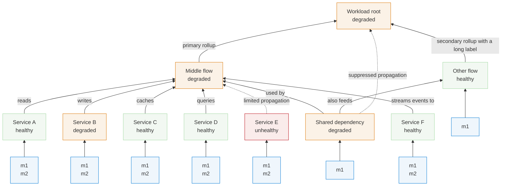

## Pills stress test

Many labeled relationships to verify pills never overlap and always clearly belong to one line.

```mermaid
flowchart BT
    aSig["m1<br/>m2"] --> a["Service A<br/>healthy"]
    bSig["m1<br/>m2"] --> b["Service B<br/>degraded"]
    cSig["m1<br/>m2"] --> c["Service C<br/>healthy"]
    dSig["m1<br/>m2"] --> d["Service D<br/>healthy"]
    eSig["m1<br/>m2"] --> e["Service E<br/>unhealthy"]
    fSig["m1<br/>m2"] --> f["Service F<br/>healthy"]

    %% many labeled edges converging on one parent (tests stacking + no overlap)
    a -->|reads| mid["Middle flow<br/>degraded"]
    b -->|writes| mid
    c -->|caches| mid
    d -->|queries| mid
    e -. "limited propagation" .-> mid
    f -->|streams events to| mid

    %% one child with multiple labeled outgoing edges (tests same-source separation)
    shared["Shared dependency<br/>degraded"] -->|used by| mid
    shared -->|also feeds| other["Other flow<br/>healthy"]
    shared -. "suppressed propagation" .-> root["Workload root<br/>degraded"]

    sSig["m1"] --> shared
    oSig["m1"] --> other

    %% straight labeled edge (child directly under parent) + siblings
    mid -->|primary rollup| root
    other -->|secondary rollup with a long label| root

    classDef blue fill:#eff6fc,stroke:#0078D4;
    classDef green fill:#f2f8f2,stroke:#a0d8a0;
    classDef amber fill:#fbf2e7,stroke:#db7500;
    classDef red fill:#faeceb,stroke:#ba0d16;
    class aSig,bSig,cSig,dSig,eSig,fSig,sSig,oSig blue;
    class a,c,d,f,other green;
    class b,mid,shared,root amber;
    class e red;
```
