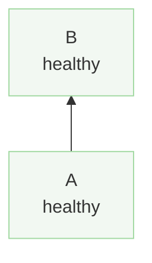

# Broken blocks

## Garbage that parses to nothing

```mermaid
flowchart BT
    this is not === valid mermaid at all
    123bad[Node ids must not start with digits]
    ---> dangling arrow
```

## Empty block

```mermaid
```

## Unknown theme

```mermaid swimlane theme=neon
flowchart BT
    a["A<br/>healthy"] --> b["B<br/>healthy"]
    classDef green fill:#f2f8f2,stroke:#a0d8a0;
    class a,b green;
```

## Unknown option key and bad lanes


