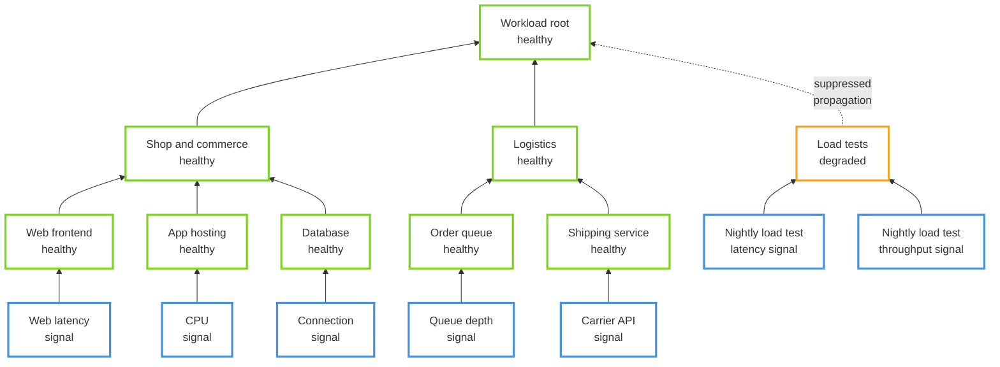
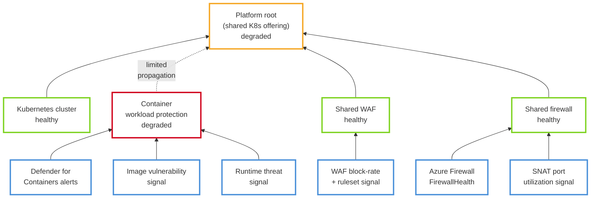
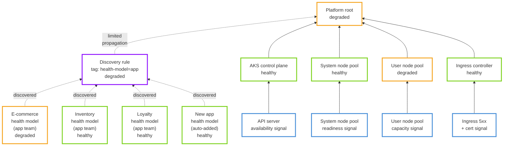

# PR #6 visual-regression fixtures

Faithful copies of the three consumer (well-architected-pr) health-model Mermaid sources that PR #6
visually regressed. They pin the pre-PR6 edge-color and routing semantics the revert restores:
state-colored connectors (never neutral/gray trunks) and clean corridor routing (no cross-row
spaghetti). Do not "simplify" these — they must stay byte-faithful to the consumer's real diagrams.

## add-operational-quality-signals-to-the-workload-model

## add-security-signals-to-your-platform-health-model

## aggregate-health-across-the-workload-portfolio

