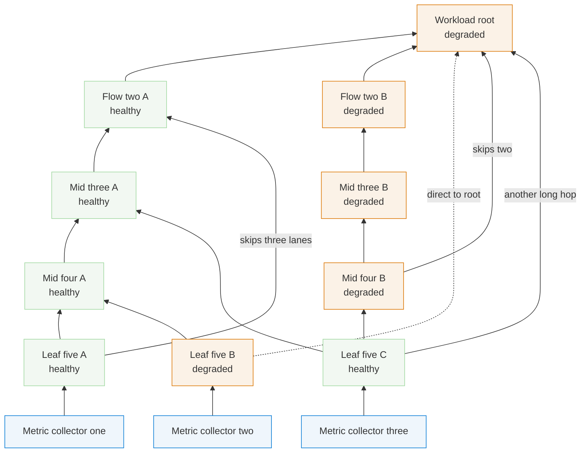

# Deep model with lane-skipping edges

Six layers; several edges skip multiple lanes (bottom entities feeding the root directly), which
forces corridor routing through intermediate lanes. Multiple skippers share corridors.

