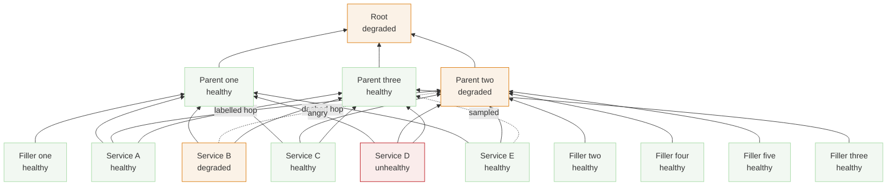

# Dense multi-parent mesh

Every child feeds every parent (K5×5-ish) — maximal crossings, shared children, one wide lane of
ten components below, all against three parents with mixed edge styles.

```mermaid
flowchart BT
    a["Service A<br/>healthy"] --> p1["Parent one<br/>healthy"]
    a --> p2["Parent two<br/>degraded"]
    a -->|labelled hop| p3["Parent three<br/>healthy"]
    b["Service B<br/>degraded"] --> p1
    b -. "dashed hop" .-> p2
    b --> p3
    c["Service C<br/>healthy"] --> p1
    c --> p2
    c --> p3
    d["Service D<br/>unhealthy"] -->|angry| p1
    d --> p2
    d --> p3
    e["Service E<br/>healthy"] --> p1
    e --> p2
    e -. sampled .-> p3

    f["Filler one<br/>healthy"] --> p1
    gg["Filler two<br/>healthy"] --> p2
    h["Filler three<br/>healthy"] --> p3
    i["Filler four<br/>healthy"] --> p2
    j["Filler five<br/>healthy"] --> p2

    p1 --> root["Root<br/>degraded"]
    p2 --> root
    p3 --> root

    classDef green fill:#f2f8f2,stroke:#a0d8a0;
    classDef amber fill:#fbf2e7,stroke:#db7500;
    classDef red fill:#faeceb,stroke:#ba0d16;
    class a,c,e,f,gg,h,i,j,p1,p3 green;
    class b,p2,root amber;
    class d red;
```
