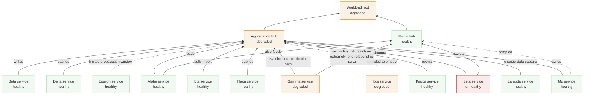

# Pill flood

Twelve labeled edges converge on one parent while a second parent shares several of the same
children; long labels, dashed labeled edges, and near-identical child positions all at once.

