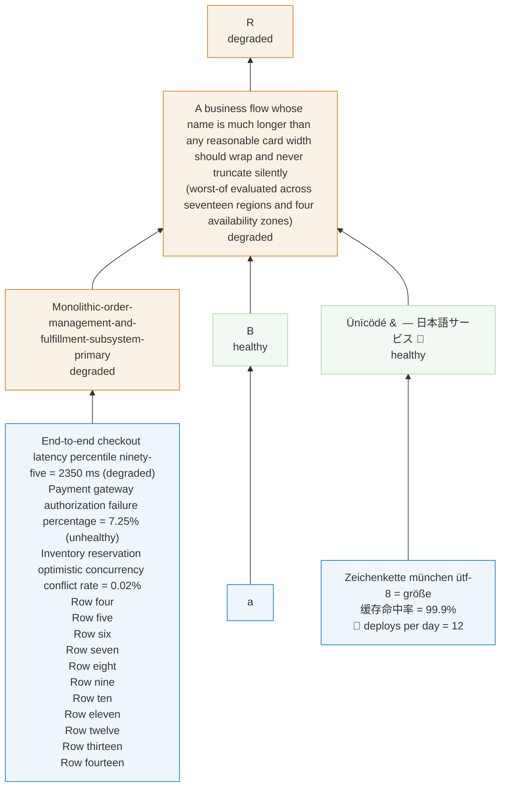

# Text extremes

Very long names, long signal rows with explicit values and states, a 14-row table, unicode,
emoji, XML-special characters, and a single-word name longer than any card.

```mermaid
flowchart BT
    bigSig["End-to-end checkout latency percentile ninety-five = 2350 ms (degraded)<br/>Payment gateway authorization failure percentage = 7.25% (unhealthy)<br/>Inventory reservation optimistic concurrency conflict rate = 0.02%<br/>Row four<br/>Row five<br/>Row six<br/>Row seven<br/>Row eight<br/>Row nine<br/>Row ten<br/>Row eleven<br/>Row twelve<br/>Row thirteen<br/>Row fourteen"] --> mono["Monolithic-order-management-and-fulfillment-subsystem-primary<br/>degraded"]
    tinySig["a"] --> tiny["B<br/>healthy"]
    uniSig["Zeichenkette münchen ütf-8 = größe<br/>缓存命中率 = 99.9%<br/>🚀 deploys per day = 12"] --> uni["Ünïcödé & <entities> — 日本語サービス 🚀<br/>healthy"]

    mono --> flow["A business flow whose name is much longer than any reasonable card width should wrap and never truncate silently<br/>(worst-of evaluated across seventeen regions and four availability zones)<br/>degraded"]
    tiny --> flow
    uni --> flow
    flow --> root["R<br/>degraded"]

    classDef blue fill:#eff6fc,stroke:#0078D4;
    classDef green fill:#f2f8f2,stroke:#a0d8a0;
    classDef amber fill:#fbf2e7,stroke:#db7500;
    class bigSig,tinySig,uniSig blue;
    class tiny,uni green;
    class mono,flow,root amber;
```
