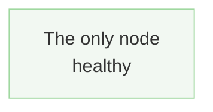
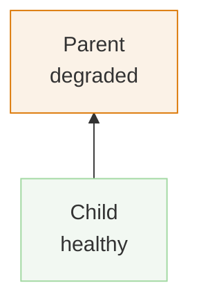
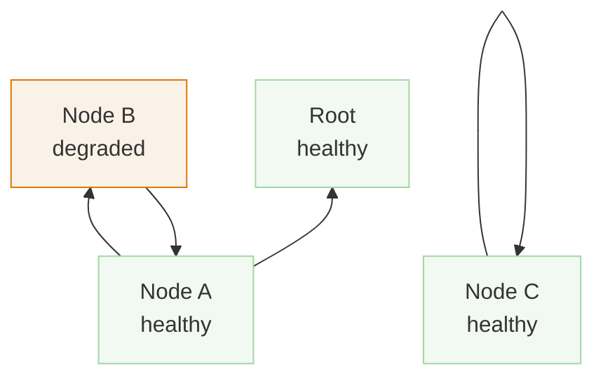
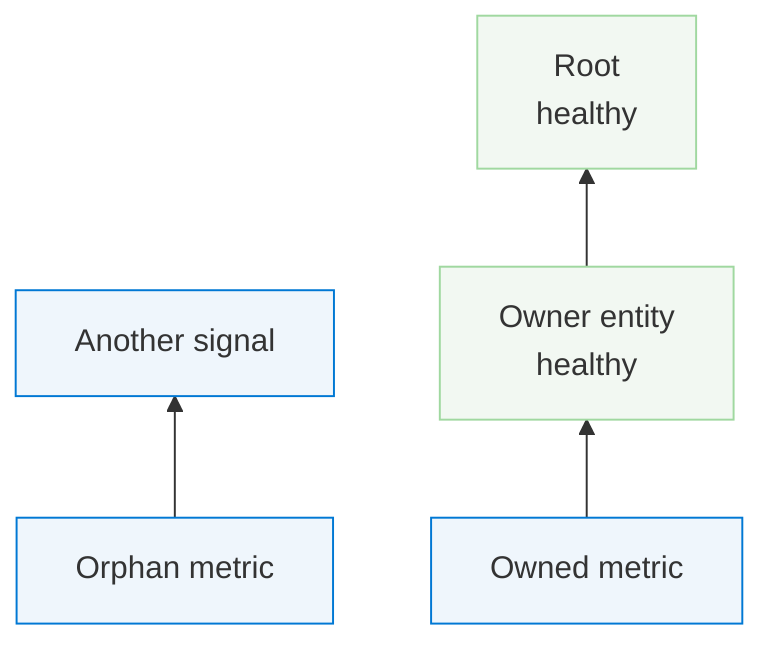

# Weird graphs

## Single node

```mermaid
flowchart BT
    only["The only node<br/>healthy"]
    classDef green fill:#f2f8f2,stroke:#a0d8a0;
    class only green;
```

## Two-node chain

```mermaid
flowchart BT
    a["Child<br/>healthy"] --> b["Parent<br/>degraded"]
    classDef green fill:#f2f8f2,stroke:#a0d8a0;
    classDef amber fill:#fbf2e7,stroke:#db7500;
    class a green;
    class b amber;
```

## Cycle and self-loop

```mermaid
flowchart BT
    a["Node A<br/>healthy"] --> b["Node B<br/>degraded"]
    b --> a
    c["Node C<br/>healthy"] --> c
    a --> r["Root<br/>healthy"]
    classDef green fill:#f2f8f2,stroke:#a0d8a0;
    classDef amber fill:#fbf2e7,stroke:#db7500;
    class a,c,r green;
    class b amber;
```

## Orphan signal and signal-to-signal

```mermaid
flowchart BT
    s1["Orphan metric"] --> s2["Another signal"]
    s3["Owned metric"] --> owner["Owner entity<br/>healthy"]
    owner --> root["Root<br/>healthy"]
    classDef blue fill:#eff6fc,stroke:#0078D4;
    classDef green fill:#f2f8f2,stroke:#a0d8a0;
    class s1,s2,s3 blue;
    class owner,root green;
```
